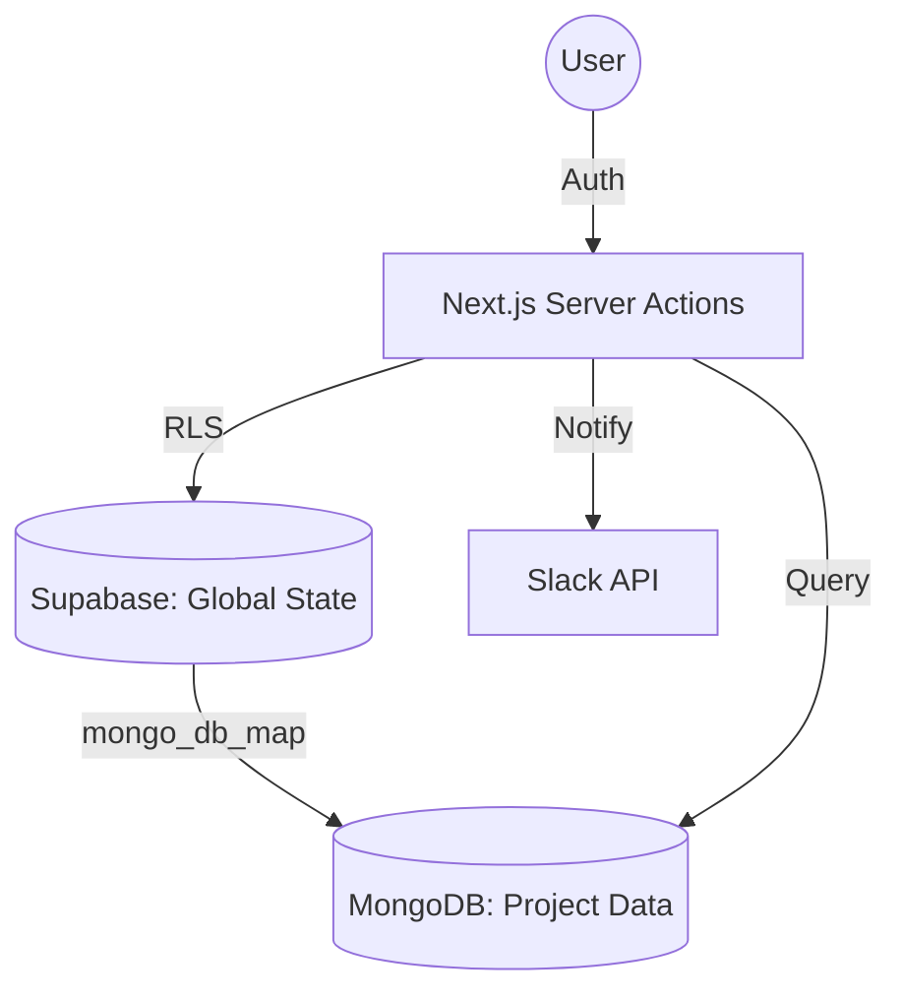

# 🛡️ Overwatch

**Overwatch** is a high-performance threat detection and case management platform built for modern content moderation teams. It streamlines the lifecycle of identifying, reviewing, and neutralizing harmful social media content through an AI-assisted workflow.

Built with a **"Calm Focus"** design philosophy, Overwatch minimizes cognitive load for moderators while providing powerful intelligence tools for clients.

---

## 🌟 Key Features

### 🔍 Intelligence & Review
- **Multi-Platform Support:** Unified interface for reviewing content from Facebook, Instagram, and X (Twitter).
- **AI-Powered Analysis:** Pre-processed risk scoring, threat classification, and Point of Interest (POI) detection.
- **Infinite Review Stream:** Specialized reviewer interface optimized for processing high volumes of posts with minimal friction.
- **Media Previews:** Secure, high-speed image and video previews served via AWS S3 presigned URLs.

### 📈 Case Management & Analytics
- **Role-Based Workflows:** Distinct interfaces and permissions for **Reviewers** (analysts) and **Clients** (decision-makers).
- **Executive Dashboard:** Real-time KPI cards and trend charts visualizing threat landscapes.
- **Takedown Lifecycle:** End-to-end tracking from "Suggested" by reviewers to "Approved" and "Resolved" by clients.
- **Automated Alerts:** Instant Slack notifications triggered upon client approval of takedowns.

### 📄 Professional Reporting
- **PDF & DOCX Exports:** Generate high-quality, branded reports for single cases or comprehensive profile summaries.
- **Detailed Audit Trails:** Track every action from discovery to resolution.

---

## 🛠️ Tech Stack

- **Framework:** [Next.js 15+](https://nextjs.org/) (App Router) & [React 19](https://react.dev/)
- **Styling:** [Tailwind CSS 4](https://tailwindcss.com/) & [Radix UI](https://www.radix-ui.com/)
- **Authentication:** [Supabase Auth](https://supabase.com/auth)
- **Databases:**
  - **Supabase (PostgreSQL):** Relational metadata, RBAC, and case status tracking.
  - **MongoDB:** Scalable storage for raw social media posts and AI analysis results.
- **Storage:** [AWS S3](https://aws.amazon.com/s3/) (Presigned URL architecture)
- **Observability:** [OpenTelemetry](https://opentelemetry.io/) (via Vercel OTEL), [PostHog](https://posthog.com/), and [Vercel Analytics](https://vercel.com/analytics)
- **Integrations:** [Slack Webhooks](https://api.slack.com/messaging/webhooks), [Nodemailer](https://nodemailer.com/)

---

## 🚀 Getting Started

### 1. Prerequisites
- Node.js 20+
- A Supabase Project
- A MongoDB Instance (Atlas or Local)
- AWS S3 Bucket

### 2. Environment Variables
Create a `.env.local` file with the following:

```env
# Supabase (Auth & Metadata)
NEXT_PUBLIC_SUPABASE_URL=your_supabase_url
NEXT_PUBLIC_SUPABASE_ANON_KEY=your_supabase_anon_key
SUPABASE_SERVICE_ROLE_KEY=your_service_role_key

# MongoDB (Raw Post Data)
MONGO_URI=your_mongodb_connection_string
MONGO_DB_NAME=overwatch

# AWS (Media Storage)
AWS_REGION=your_region
AWS_ACCESS_KEY_ID=your_key_id
AWS_SECRET_ACCESS_KEY=your_secret_access_key
AWS_BUCKET_NAME=your_bucket_name

# Integrations
SLACK_WEBHOOK_URL=your_slack_webhook
POSTHOG_API_KEY=your_posthog_key
NEXT_PUBLIC_POSTHOG_HOST=https://app.posthog.com
```

### 3. Installation & Setup
```bash
# Install dependencies
npm install

# Initialize MongoDB Indexes (Required for performance)
node scripts/ensure_indexes.js

# Run development server
npm run dev
```

---

## 🏗️ Architecture & Data Flow

Overwatch uses a **hybrid database strategy** to balance relational integrity with document flexibility and tenant isolation:

### 1. The Hybrid Database Pattern
- **Supabase (PostgreSQL):** Acts as the **System of Record**. It manages global state, including user authentication, RBAC permissions, project configurations, aggregated dashboard metrics, and long-running task states (like report generation).
- **MongoDB (Per-Tenant Data):** Acts as the **Intelligence Store**. To ensure data isolation and scalability, each project (tenant) is mapped to a specific MongoDB database via the `mongo_db_map` field in the Supabase `project` table. This is where high-volume raw social media posts and AI analysis results reside.

### 2. Data Lifecycle
1.  **Ingestion:** External crawlers or user-submitted links (via `client_requested_links`) are processed and stored in the project's dedicated **MongoDB** instance.
2.  **Review:** Analysts use the `(dashboard)/review-cases` route to fetch data directly from MongoDB.
3.  **State Sync:** Once a reviewer suggests an action, the status is tracked in **Supabase** to handle complex multi-step workflows and client-facing dashboards.
4.  **Reporting:** When a report is requested, a record is created in `reports_generation`. The resulting file is stored in S3, and the metadata is updated in Supabase.



---

## 🔐 Authentication & Data Fetching

### Server-Side First
Overwatch leverages **Next.js Server Actions** and **React Server Components (RSC)** for all data operations. This ensures:
- **Security:** API keys and database credentials never leave the server.
- **Performance:** Reduced client-side JavaScript and faster initial loads.
- **Type Safety:** Seamless data flow from the database to the UI.

### Authentication Flow
1. **Middleware:** `src/proxy.js` and Supabase middleware validate the user session on every request.
2. **Permission Check:** The `getUserPermission()` utility (in `src/utils/permissions.js`) fetches the user's role from the `client_details` table to gate access to specific routes (e.g., only Reviewers can see `review-cases`).
3. **Session Management:** Auth is handled via Supabase GoTrue, with sessions persisted in secure, HTTP-only cookies.

### Session Persistence Policy (Production)
To avoid unexpected idle logouts, cookie lifetime alone is not sufficient. Supabase token/session policy must be aligned with app middleware refresh behavior.

Recommended policy for this app:
- Target persistence: **30 days** (unless user signs out or session is revoked)
- Access token (JWT) lifetime: **30-60 minutes**
- Refresh/session maximum lifetime: **30 days**
- Token rotation/reuse: keep Supabase secure defaults enabled

Supabase dashboard checklist:
- Authentication -> Sessions:
  - Configure session maximum lifetime to 30 days
  - Confirm access token lifetime is not set to an extremely short value
- Authentication -> URL configuration:
  - Ensure site URL and redirect URLs match your deployed domain(s)
- After changing auth settings:
  - Sign out and sign back in once to establish a fresh session
  - Validate idle scenarios (15m, 30m, 60m, overnight) on protected routes

---

## 📊 Database Schema Reference

### 1. Supabase (Relational & Global)

| Table | Description |
| :--- | :--- |
| `project` | The root configuration for each client/tenant. Contains `mongo_db_map` for DB routing. |
| `client_details` | Extends Supabase Auth with app-specific metadata (permissions, project assignment, alias). |
| `client_logs` | Daily audit logs tracking user activity, logins, and cases reviewed for performance metrics. |
| `client_requested_links` | Queue for user-submitted URLs waiting for ingestion into the system. |
| `daily_case_metrics` | Aggregated statistics (risk, platform, categories) used for dashboard visualizations. |
| `daily_reviewed_metrics` | Tracks client-side review progress and outcomes for trend analysis. |
| `notifications` | In-app notification system for alerting users to system actions or approvals. |
| `reports_generation` | Management table for PDF/Docx exports, tracking status, hashes, and S3 paths. |
| `watchlist` | Stores profiles or links that require ongoing monitoring and automated checks. |

### 2. MongoDB (Intelligence & Tenant-Specific)

Each project has its own isolated database with the following primary collections:

| Collection | Description |
| :--- | :--- |
| `Posts` | The main repository for social media content. Stores raw data, engagement metrics, and AI-driven risk analysis. |
| `Profiles` | Detailed metadata for monitored social media accounts, including follower counts and platform history. |
| `Keywords` | List of active search terms and phrases used by ingestion engines to discover new content. |
| `ResearchWatchlist` | Groups of keywords and profiles organized by "Topic" for targeted intelligence research. |
| `unique_clusters` | AI-generated groupings of related posts, used to identify emerging trends or coordinated campaigns. |

---

## � Sample Data

To understand the exact data structures used in the system, refer to the `sample_documents/` directory:
- **MongoDB Samples:** `sample_documents/mongodb/` contains real-world JSON exports for `Posts`, `Profiles`, and `ResearchWatchlist`.
- **Supabase Definitions:** `supabase/tables info` contains the SQL DDL for the relational schema.

---

## �📁 Project Structure

- `src/app/`: Next.js App Router (Dashboard, Auth, Actions).
- `src/components/`: Reusable UI components (PDF/Docx logic, Charts, Tables).
- `src/utils/`: Core logic for Supabase, MongoDB, AWS, and Tracing.
- `src/instrumentation.js`: OpenTelemetry registration for server-side monitoring.
- `scripts/`: Maintenance utilities (migrations, index management, debug tools).

---

## 🛠️ Maintenance Scripts

| Script | Purpose |
| :--- | :--- |
| `ensure_indexes.js` | Configures required MongoDB indexes for fast filtering. |
| `backup_mongodb.js` | Local backup utility for MongoDB collections. |
| `migrate_v2.js` | Schema migration tool for moving from V1 to V2 data structures. |
| `debug_ai_filter.js` | Utility to test and debug AI risk scoring logic. |

---

## 🎨 Design System: "Calm Focus"

The UI is built to reduce "Moderator Fatigue":
- **Cool Palette:** Heavy use of Slate and Trustworthy Blues.
- **Typography:** [Outfit](https://fonts.google.com/specimen/Outfit) for high readability.
- **Soft Precision:** 12px border radius and subtle shadows.

---

## 📄 License
Internal Property - All Rights Reserved.

- Generates presigned URL valid for 1 hour
- Graceful fallback for missing/invalid images

### Key Components

**Sidebar (`components/Sidebar.js`):**
- Collapsible navigation menu
- Routes: Dashboard (`/`), Review Cases (`/review-cases`), Cases List, Takedowns, Settings
- Currently, only Dashboard and Review Cases are implemented

**MetricsCards (`components/MetricsCards.js`):**
- Displays 3 KPIs: Total Cases, Active Takedowns, High Risk count
- Data aggregated from `cases_metadata` table

**ThreatChart (`components/ThreatChart.js`):**
- Recharts bar chart showing threat distribution by type
- Categories: scam, hate_speech, violence, nsfw, fake_news, other

**ReviewInterface (`components/ReviewInterface.js`):**
- Two-panel layout: infinite scroll table (left) + review form (right)
- Fetches unreviewed posts from MongoDB
- Form submits new case to `cases_metadata` table with threat classification

**ProfilePic (`components/ProfilePic.js`):**
- Generates deterministic avatar color based on username hash
- Used for user identification in UI

### Important Patterns & Conventions

**Server-Side Data Fetching:**
- Always use server components for initial data loads
- Server actions for mutations and user-triggered fetches
- Supabase client created per-request with SSR cookie handling

**Error Handling:**
- Supabase queries return `{ data, error }` - always check error
- MongoDB connection uses singleton pattern with error logging
- S3 presigned URL generation wrapped in try/catch

**Type Safety:**
- No TypeScript - relies on JSDoc comments and runtime validation
- Path aliases prevent relative import confusion

**Styling:**
- Tailwind CSS 4 utility classes
- Custom color palette for threat severity indicators
- Responsive design with mobile-first approach

### Placeholder Routes

The following routes exist in Sidebar navigation but are NOT implemented:
- `/cases` - Full case list view
- `/takedowns` - Takedown management dashboard
- `/settings` - User/system settings

## Database Migrations

Run migrations after setting up `.env.local` with `DATABASE_URL`:

```bash
# Create cases_metadata table with RLS policies
node scripts/setup_db.js

# Create client_details table for user permissions
node scripts/setup_client_details.js
```

**Row-Level Security (RLS) Policies:**
- `cases_metadata`: Read access for all, insert/update for authenticated users only
- `client_details`: Users can only view their own permission record

## Integration Notes

**Supabase:**
- All queries use async/await pattern
- Client created per-request to maintain session context
- Auth middleware refreshes tokens automatically

**MongoDB:**
- Connection pooled via singleton pattern in `utils/mongodb/client.js`
- Database name specified via environment variable
- Queries use native MongoDB Node.js driver (v7.0.0)

**AWS S3:**
- Presigned URLs valid for 3600 seconds (1 hour)
- SDK v3 used: `@aws-sdk/client-s3` + `@aws-sdk/s3-request-presigner`
- URL parsing handles multiple S3 URL formats

## Security Considerations

- All routes protected by middleware auth check
- RLS policies enforce database-level access control
- S3 images served via time-limited presigned URLs
- Credentials stored in `.env.local` (gitignored)
- No plaintext credentials in codebase
