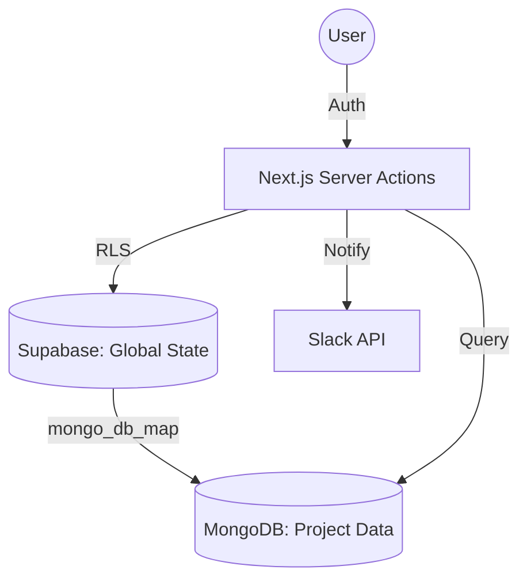

# 🛡️ Overwatch

**Overwatch** is a high-performance threat detection and case management platform built for modern content moderation teams. It streamlines the lifecycle of identifying, reviewing, and neutralizing harmful social media content through an AI-assisted workflow.

Built with a **"Calm Focus"** design philosophy, Overwatch minimizes cognitive load for moderators while providing powerful intelligence tools for clients.

---

## 🌟 Key Features

### 🔍 Intelligence & Review
- **Posts, ads, and domains:** Separate reviewer and client surfaces for social posts, ad creatives, advertiser profiles, and destination domains. Project settings can turn each section on or off.
- **AI-assisted review:** Risk scoring, threat types, and Point of Interest (POI) detection, with a reviewer stream for posts, ads, profiles, and domains.
- **POIs and profiles:** Parent POIs (aliases collapsed), profile detail pages, and ad-profile detail pages with linked domains and recent creatives.
- **Media previews:** Image and video previews via AWS S3 presigned URLs, including stored video thumbnails on the ads list.

### 📈 Case Management & Analytics
- **Role-based workflows:** Distinct interfaces for **Reviewers**, **Clients**, and **Client admins**.
- **Analytics dashboard:** Metrics split by entity type (posts, ads, domains) on one dashboard.
- **Nexus graphs:** Force-layout maps for feeds (POI → topics), posts (topics, POI categories, or profiles), and ads (ad profiles or domains). See [docs/nexus.md](docs/nexus.md).
- **Feeds:** Reviewers curate topics, posts, and optional ad ids. Clients browse a topic map at `/feeds` and collections at `/feeds/collections`.
- **Takedown lifecycle:** Tracking from reviewer suggestion through client approval, with Slack notifications on approval.

### 📄 Professional Reporting
- **PDF and DOCX exports:** Case, profile, and domain reports.
- **Audit trails:** Case events from discovery through resolution.

---

## 🛠️ Tech Stack

- **Framework:** [Next.js 15+](https://nextjs.org/) (App Router) & [React 19](https://react.dev/)
- **Styling:** [Tailwind CSS 4](https://tailwindcss.com/) & [Radix UI](https://www.radix-ui.com/)
- **Authentication:** [Supabase Auth](https://supabase.com/auth)
- **Databases:**
  - **Supabase (PostgreSQL):** Relational metadata, RBAC, and case status tracking.
  - **MongoDB:** Scalable storage for raw social media posts and AI analysis results.
- **Storage:** [AWS S3](https://aws.amazon.com/s3/) (Presigned URL architecture)
- **Observability:** [OpenTelemetry](https://opentelemetry.io/) → Grafana (Loki / Tempo / Mimir) — see [docs/observability.md](docs/observability.md); [PostHog](https://posthog.com/) for product analytics
- **Integrations:** [Slack Webhooks](https://api.slack.com/messaging/webhooks), [Nodemailer](https://nodemailer.com/)

---

## 🚀 Getting Started

### 1. Prerequisites
- Node.js 20+
- A Supabase Project
- A MongoDB Instance (Atlas or Local)
- AWS S3 Bucket

### 2. Environment Variables
Create a `.env.local` file with the following:

```env
# Supabase (Auth & Metadata)
NEXT_PUBLIC_SUPABASE_URL=your_supabase_url
NEXT_PUBLIC_SUPABASE_ANON_KEY=your_supabase_anon_key
SUPABASE_SERVICE_ROLE_KEY=your_service_role_key

# MongoDB (Raw Post Data)
MONGO_URI=your_mongodb_connection_string
MONGO_DB_NAME=overwatch

# AWS (Media Storage)
AWS_REGION=your_region
AWS_ACCESS_KEY_ID=your_key_id
AWS_SECRET_ACCESS_KEY=your_secret_access_key
AWS_BUCKET_NAME=your_bucket_name

# Integrations
SLACK_WEBHOOK_URL=your_slack_webhook
POSTHOG_API_KEY=your_posthog_key
NEXT_PUBLIC_POSTHOG_HOST=https://app.posthog.com
```

### 3. Installation & Setup
```bash
# Install dependencies
npm install

# Initialize MongoDB Indexes (Required for performance)
node scripts/ensure_indexes.js

# Run development server
npm run dev
```

---

## 🏗️ Architecture & Data Flow

Overwatch uses a **hybrid database strategy** to balance relational integrity with document flexibility and tenant isolation:

### 1. The Hybrid Database Pattern
- **Supabase (PostgreSQL):** Acts as the **System of Record**. It manages global state, including user authentication, RBAC permissions, project configurations, aggregated dashboard metrics, and long-running task states (like report generation).
- **MongoDB (Per-Tenant Data):** Acts as the **Intelligence Store**. To ensure data isolation and scalability, each project (tenant) is mapped to a specific MongoDB database via the `mongo_db_map` field in the Supabase `project` table. This is where high-volume raw social media posts and AI analysis results reside.

### 2. Data Lifecycle
1.  **Ingestion:** External crawlers or user-submitted links (via `client_requested_links`) are processed and stored in the project's dedicated **MongoDB** instance.
2.  **Review:** Analysts use the `(dashboard)/review-cases` route to fetch data directly from MongoDB.
3.  **State Sync:** Once a reviewer suggests an action, the status is tracked in **Supabase** to handle complex multi-step workflows and client-facing dashboards.
4.  **Reporting:** When a report is requested, a record is created in `reports_generation`. The resulting file is stored in S3, and the metadata is updated in Supabase.



---

## 🔐 Authentication & Data Fetching

### Server-Side First
Overwatch leverages **Next.js Server Actions** and **React Server Components (RSC)** for all data operations. This ensures:
- **Security:** API keys and database credentials never leave the server.
- **Performance:** Reduced client-side JavaScript and faster initial loads.
- **Type Safety:** Seamless data flow from the database to the UI.

### Authentication Flow
1. **Middleware:** `src/proxy.js` and Supabase middleware validate the user session on every request.
2. **Permission Check:** The `getUserPermission()` utility (in `src/utils/permissions.js`) fetches the user's role from the `client_details` table to gate access to specific routes (e.g., only Reviewers can see `review-cases`).
3. **Session Management:** Auth is handled via Supabase GoTrue, with sessions persisted in secure, HTTP-only cookies.

### Session Persistence Policy (Production)
To avoid unexpected idle logouts, cookie lifetime alone is not sufficient. Supabase token/session policy must be aligned with app middleware refresh behavior.

Recommended policy for this app:
- Target persistence: **30 days** (unless user signs out or session is revoked)
- Access token (JWT) lifetime: **30-60 minutes**
- Refresh/session maximum lifetime: **30 days**
- Token rotation/reuse: keep Supabase secure defaults enabled

Supabase dashboard checklist:
- Authentication -> Sessions:
  - Configure session maximum lifetime to 30 days
  - Confirm access token lifetime is not set to an extremely short value
- Authentication -> URL configuration:
  - Ensure site URL and redirect URLs match your deployed domain(s)
- After changing auth settings:
  - Sign out and sign back in once to establish a fresh session
  - Validate idle scenarios (15m, 30m, 60m, overnight) on protected routes

---

## 📊 Database Schema Reference

### 1. Supabase (Relational & Global)

| Table | Description |
| :--- | :--- |
| `project` | The root configuration for each client/tenant. Contains `mongo_db_map` for DB routing. |
| `client_details` | Extends Supabase Auth with app-specific metadata (permissions, project assignment, alias). |
| `client_logs` | Daily audit logs tracking user activity, logins, and cases reviewed for performance metrics. |
| `client_requested_links` | Queue for user-submitted URLs waiting for ingestion into the system. |
| `daily_case_metrics` | Aggregated statistics (risk, platform, categories) used for dashboard visualizations. |
| `daily_reviewed_metrics` | Tracks client-side review progress and outcomes for trend analysis. |
| `notifications` | In-app notification system for alerting users to system actions or approvals. |
| `reports_generation` | Management table for PDF/Docx exports, tracking status, hashes, and S3 paths. |
| `watchlist` | Stores profiles or links that require ongoing monitoring and automated checks. |

### 2. MongoDB (Intelligence & Tenant-Specific)

Each project has its own isolated database with the following primary collections:

Canonical names are in [`src/utils/mongodb/collections.js`](src/utils/mongodb/collections.js).

| Collection | Description |
| :--- | :--- |
| `Posts` | Social posts. List queries use materialized `list.*` / `workflow.*` fields (schema v3). |
| `profiles` | Social accounts. Client list uses the same visibility gate as Posts Nexus profile hubs. |
| `Ads` / `Ad_profiles` | Ad creatives and advertiser pages. Not stored in `Posts`. |
| `Domains` | Destination domains, including cloak-lander review fields. |
| `topics` | Topic membership (`posts[]`). Feeds reference `topic_id`. |
| `pois` | Parent POIs, aliases, category, and activity range. |
| `Feeds` | Curated references: `topic_ids`, `manual_post_ids`, `manual_ad_ids`. |
| `case_events` | Audit log (`entity_type` distinguishes posts, ads, profiles, domains). |
| `post_embeddings` | Vector index documents, 1:1 with posts. |

---

## Product surfaces

Navigation is grouped in [`src/components/Sidebar.js`](src/components/Sidebar.js). Reviewer-only items are hidden for clients. Sections the project has disabled render a disabled fallback instead of data.

| Area | Client | Reviewer |
| :--- | :--- | :--- |
| Analytics | `/` | `/` |
| Posts | `/cases`, `/posts/nexus`, `/profiles`, `/pois` | `/review-cases`, `/review-profiles` |
| Ads | `/ads`, `/ads/nexus`, `/ad-profiles`, `/ad-profiles/[id]` | `/review-ads`, `/review-ad-profiles` |
| Domains | `/domains` | `/review-domains` |
| Feeds | `/feeds` (topic map), `/feeds/collections` | `/manage-feeds` |
| Ops | `/takedowns`, `/upload-content`, `/configurations`, `/reports` | plus `/admin` for reviewers and client-admins |

Cases list filters and sort are documented in [`src/app/(dashboard)/cases/CASES_DATA_FETCHING_README.md`](src/app/(dashboard)/cases/CASES_DATA_FETCHING_README.md). Default list order is risk bucket, then IST alert day, then engagement — not a raw score sort.

---

## Docs

| Doc | What it covers |
| :--- | :--- |
| [docs/nexus.md](docs/nexus.md) | Graph presets, queries, and visibility gates |
| [docs/feeds/manage-feeds-implementation-review.md](docs/feeds/manage-feeds-implementation-review.md) | Feed documents, topic assignment, collections vs topic map |
| [docs/contracts/posts-profiles-schema-v3.md](docs/contracts/posts-profiles-schema-v3.md) | Posts / profiles write contract |
| [docs/contracts/ads-ad-profiles-schema-v3.md](docs/contracts/ads-ad-profiles-schema-v3.md) | Ads / ad profiles write contract |
| [docs/contracts/domains-schema-v1.md](docs/contracts/domains-schema-v1.md) | Domains write contract |
| [docs/prd/domain-pdf-reports.md](docs/prd/domain-pdf-reports.md) | Domain PDF reports |
| [docs/observability.md](docs/observability.md) | Logs, traces, metrics |
| [docs/db-schema-v3-ui-migration.md](docs/db-schema-v3-ui-migration.md) | Historical v3 cutover notes (not the live collection list) |

Sample documents live under `sample_documents/`. Supabase DDL is under `supabase/`.

---

## Project structure

- `src/app/(dashboard)/`: App Router pages and server actions (cases, ads, domains, feeds, nexus, pois, profiles).
- `src/lib/nexus/`: Graph contract, queries, and canvas engine.
- `src/components/`: Shared UI (cards, nexus shell, reports).
- `src/utils/`: Supabase, MongoDB, AWS, tracing.
- `src/instrumentation.js`: OpenTelemetry registration.
- `scripts/`: Indexes, migrations, and one-off POI/topic labeling tools.

---

## 🛠️ Maintenance Scripts

| Script | Purpose |
| :--- | :--- |
| `ensure_indexes.js` | Configures required MongoDB indexes for fast filtering. |
| `backup_mongodb.js` | Local backup utility for MongoDB collections. |
| `migrate_v2.js` | Schema migration tool for moving from V1 to V2 data structures. |
| `debug_ai_filter.js` | Utility to test and debug AI risk scoring logic. |

---

## 🎨 Design System: "Calm Focus"

The UI is built to reduce "Moderator Fatigue":
- **Cool Palette:** Heavy use of Slate and Trustworthy Blues.
- **Typography:** [Outfit](https://fonts.google.com/specimen/Outfit) for high readability.
- **Soft Precision:** 12px border radius and subtle shadows.

---

## 📄 License
Internal Property - All Rights Reserved.

### Key components

**Sidebar (`components/Sidebar.js`):**
- Grouped nav for posts, ads, and domains, plus feeds, takedowns, and reports
- Reviewer-only children are omitted for clients
- Disabled project sections stay visible but do not load data

**Cases list (`/cases`):**
- Server-paginated reviewed posts. Filters and sort are URL params. See the cases fetching readme.
- Detail is a route or in-page panel with prev/next on the current page queue

**Nexus (`/posts/nexus`, `/ads/nexus`, `/feeds`):**
- Shared canvas. L1 is hubs and clusters; L2 leaf stubs load on expand. See [docs/nexus.md](docs/nexus.md).

### Important Patterns & Conventions

**Server-Side Data Fetching:**
- Always use server components for initial data loads
- Server actions for mutations and user-triggered fetches
- Supabase client created per-request with SSR cookie handling

**Error Handling:**
- Supabase queries return `{ data, error }` - always check error
- MongoDB connection uses singleton pattern with error logging
- S3 presigned URL generation wrapped in try/catch

**Type Safety:**
- No TypeScript - relies on JSDoc comments and runtime validation
- Path aliases prevent relative import confusion

**Styling:**
- Tailwind CSS 4 utility classes
- Custom color palette for threat severity indicators
- Responsive design with mobile-first approach

## Integration notes

**Supabase:**
- Auth and project metadata. Session refresh is in middleware; see the session policy above.
- Tenant data is not stored in `cases_metadata`. Case status lives on the Mongo document (`workflow.client_status`) plus `case_events`.

**MongoDB:**
- Connection pooled in `src/utils/mongodb/client.js`.
- The database name comes from the project's `mongo_db_map`, not a single env database, except for maintenance scripts that take `MONGO_DB_NAME`.
- Queries use the native MongoDB Node.js driver.

**AWS S3:**
- Presigned URLs valid for 3600 seconds (1 hour)
- SDK v3 used: `@aws-sdk/client-s3` + `@aws-sdk/s3-request-presigner`
- URL parsing handles multiple S3 URL formats

## Security Considerations

- All routes protected by middleware auth check
- RLS policies enforce database-level access control
- S3 images served via time-limited presigned URLs
- Credentials stored in `.env.local` (gitignored)
- No plaintext credentials in codebase
