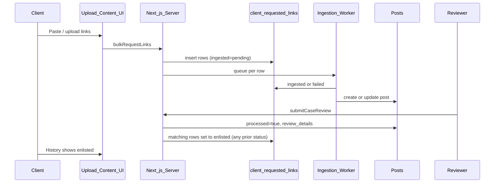

# Client-requested links: enlisted status and centralized module

## Summary

Clients can submit URLs on **Upload Content**; those rows live in Supabase `client_requested_links` and are ingested by an external worker. When a **reviewer** publishes a case review, matching link rows are set to `enlisted` for the **Upload Content history** UI only (the Cases dashboard is unrelated and does not use this table).

All logic for this table—constants, URL parsing, UI labels, and Supabase access—is centralized under `src/utils/clientRequestedLinks/`. Upload-content server actions are thin wrappers around that module.

---

## Lifecycle



| Status | Meaning |
|--------|---------|
| `pending` | Queued in Supabase; waiting for ingestion worker |
| `ingested` | Worker stored the post in MongoDB; awaiting or completed review |
| `failed` | Ingestion failed |
| `enlisted` | Reviewer published the case (Upload Content history only) |

These four values are enforced by the Postgres check constraint on `client_requested_links.ingested` (see `supabase/tables info`).

---

## Central module layout

```
src/utils/clientRequestedLinks/
├── constants.js   # Status enum + isKnownIngestedStatus()
├── urls.js        # isValidHttpUrl, parseUrlsFromText, partitionUrls
├── display.js     # formatIngestionStatusLabel, getIngestionStatusBadgeClass
├── server.js      # Supabase insert / list / enlisted update ('use server')
└── index.js       # Client-safe re-exports (no server-only code)
```

### `constants.js`

- `CLIENT_REQUESTED_LINK_INGESTED_STATUSES`: `pending`, `ingested`, `failed`, `enlisted`
- `CLIENT_REQUESTED_LINK_DEFAULT_INGESTED`: `pending` (DB default; not required on insert)
- `isKnownIngestedStatus(status)` for validation and display

### `urls.js`

Shared URL handling for both the upload UI (live preview) and server insert:

- **`parseUrlsFromText(text)`** — Extract unique valid `http(s)` URLs from bulk paste or CSV text (used in `RequestContentPage.js`).
- **`partitionUrls(rawLinks)`** — Split an array of strings into `validLinks` and `invalidLinks` (used in `insertClientRequestedLinks`).

Matching between Mongo posts and Supabase rows uses **exact string equality** on `link` by design: client-submitted URLs are stored unchanged in `original_url` and used as the canonical identifier across the system (no trailing-slash or host-alias normalization).

### `display.js`

UI helpers used only for the upload history table:

- Known statuses render as their lowercase name (`pending`, `ingested`, …).
- Unknown or legacy values render as `unknown` with slate badge styling (default branch).
- Removed legacy mappings (`processed`, `resolved`, `analyzing`, boolean → pending).

| Status | Badge color |
|--------|-------------|
| `pending` | Amber |
| `ingested` | Emerald |
| `failed` | Rose |
| `enlisted` | Violet |
| Other | Slate (`unknown`) |

### `server.js`

| Function | Auth client | Purpose |
|----------|-------------|---------|
| `insertClientRequestedLinks` | Session (`createClient`) | Client bulk insert; respects RLS |
| `getClientRequestedLinksForUser` | Session | List rows for `requested_by` + `project` |
| `markClientRequestedLinksEnlisted` | **Service role** | Reviewer updates client-owned rows |

**Why service role for enlisted?**  
Clients insert and read their own rows via RLS. Reviewers are a different user; updating another user’s `client_requested_links` rows requires bypassing RLS (same pattern as `src/app/(dashboard)/admin/actions.js`).

**Enlisted update rules:**

1. Collect URL candidates from the Mongo post: `original_url`, `url`, `result_origin.source_url` (deduped).
2. `UPDATE` where `link IN (candidates)` and `project = project_name` — **any** current `ingested` value (`pending`, `ingested`, `failed`, etc.) becomes `enlisted`.
3. Review→client always wins over worker timing (e.g. review while still `pending` is safe). The external ingestion worker only updates `pending` → `ingested` or `failed` and does not modify other statuses.
4. All matching rows are updated (duplicate submissions of the same link all become `enlisted`).
5. Re-review is idempotent (rows already `enlisted` stay `enlisted`).
6. Posts with no matching `client_requested_links` row (crawler, manual, etc.) are a no-op.

Requires `SUPABASE_SERVICE_ROLE_KEY` in the server environment. If missing, the update is skipped with a warning; the review still succeeds (best-effort, same as `updateDailyMetrics`).

---

## App integration

### Upload Content

| File | Role |
|------|------|
| `src/app/(dashboard)/upload-content/actions.js` | Auth, tracing, SQS enqueue, Slack notify; delegates DB to `insertClientRequestedLinks` / `getClientRequestedLinksForUser` |
| `src/app/(dashboard)/upload-content/RequestContentPage.js` | Imports `parseUrlsFromText`, `formatIngestionStatusLabel`, `getIngestionStatusBadgeClass` from `@/utils/clientRequestedLinks` |

`manualPostActions.js` does not use `client_requested_links` (manual posts go straight to MongoDB).

### Review Cases

| File | Role |
|------|------|
| `src/app/(dashboard)/review-cases/actions.js` | After successful `submitCaseReview` Mongo update, calls `markClientRequestedLinksEnlisted({ post: existingPost, projectName })` with `.catch()` so Supabase failures do not fail the review |

**Out of scope:** `src/app/(dashboard)/cases/feature_actions.js` also has a `submitCaseReview` for **client** re-edits; enlisted is not applied there. The Cases page does not read `client_requested_links` — cases can enter Mongo via many paths besides Upload Content.

---

## External dependencies

| Component | Responsibility |
|-----------|----------------|
| Ingestion worker (SQS consumer, not in this repo) | `pending` → `ingested` or `failed` only; writes Mongo `Posts`; does not change `enlisted` or other statuses |
| `SUPABASE_SERVICE_ROLE_KEY` | Enlisted transition from review-cases |
| `AWS_*` SQS config | Queue links after client submit (`upload-content/actions.js`) |

---

## Verification checklist

1. Client submits link on Upload Content → row appears as `pending`, then `ingested` after worker runs.
2. Reviewer submits review for that post → row(s) with same `link` + `project` become `enlisted`.
3. Review while row still `pending` or `failed` → row becomes `enlisted` (override).
4. Upload history shows violet **enlisted** badge.
5. Re-submit review → status stays `enlisted`.
6. Review a non-client-requested post → review succeeds; no Supabase row changes.
7. Duplicate link submissions → all matching rows for that URL/project update together.

---

## Files changed (reference)

**Added**

- `src/utils/clientRequestedLinks/constants.js`
- `src/utils/clientRequestedLinks/urls.js`
- `src/utils/clientRequestedLinks/display.js`
- `src/utils/clientRequestedLinks/server.js`
- `src/utils/clientRequestedLinks/index.js`
- `docs/client-requested-links-enlisted-flow.md` (this document)

**Removed**

- `src/utils/supabase/clientRequestedLinks.js` (replaced by module above)

**Updated**

- `src/app/(dashboard)/upload-content/actions.js`
- `src/app/(dashboard)/upload-content/RequestContentPage.js`
- `src/app/(dashboard)/review-cases/actions.js`

---

## Future improvements (not implemented)

- RLS policy allowing reviewers to update `ingested` on their project instead of service role.
- Shared enlisted helper if another publish path needs the same behavior.
