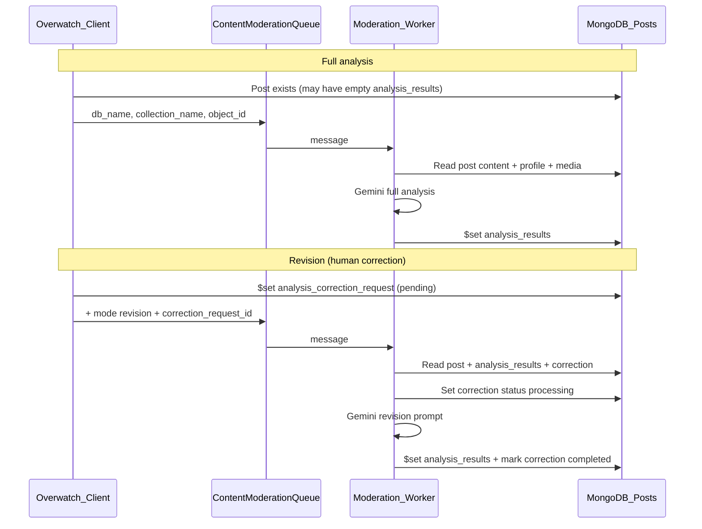

# Content Moderation Worker Guide

Guide for the **overwatch-content-moderation** team: how the AI analysis pipeline is triggered, what data you receive, where to read it from, and what to write back to MongoDB.

This document covers **two pipelines** that share the same SQS queue and the same output field (`analysis_results`), but differ in trigger shape and processing logic.

| Pipeline | Trigger | Purpose |
|----------|---------|---------|
| **Full analysis** | SQS message with 3 fields only | First-time AI verdict on a post (or blind re-run) |
| **Revision** | SQS message with `mode: "revision"` | Human-guided fix — reviewer corrected labels/risk; AI rewrites reasoning |

---

## End-to-end overview



**Golden rule:** The worker **only** owns the AI layer. Never write to `review_details` — that is the human reviewer's finalized verdict, separate from AI output.

---

## SQS queue

| Setting | Value |
|---------|-------|
| Env var (client) | `AWS_CONTENT_MODERATION_SQS_QUEUE_URL` |
| Region | `ap-south-1` (default) |

Every message is JSON. All paths include these three fields:

| Field | Type | Description |
|-------|------|-------------|
| `db_name` | string | Tenant Mongo database name (e.g. project-specific DB) |
| `collection_name` | string | Always `"Posts"` today |
| `object_id` | string | Mongo `_id` of the post document |

**Route on `mode`:**

```
if message.mode === "revision"  →  revision pipeline
else                          →  full analysis pipeline (default)
```

Do not require `mode: "full"` — missing `mode` means full analysis.

---

## Pipeline 1: Full analysis

### When this fires

| Source | What happens |
|--------|----------------|
| **Manual post upload** | Reviewer uploads a post with "Queue AI analysis" enabled → message sent right after insert |
| **Re-run AI Analysis** button | Reviewer clicks full re-run in the review UI — **ignores any form edits**; blind fresh analysis |
| **Any legacy ingest** | Any caller that sends the 3-field message without `mode` |

Full re-run is **blocked** while a correction is `pending` or `processing` on that post.

### SQS message (full analysis)

```json
{
  "db_name": "tenant_db",
  "collection_name": "Posts",
  "object_id": "507f1f77bcf86cd799439011"
}
```

No other keys. Do not expect a correction payload in SQS.

### Where to read inputs (Mongo)

Connect to `db_name` → collection `Posts` → find by `_id: object_id`.

| Field | Use for |
|-------|---------|
| `post_content.caption` | Primary text evidence |
| `post_content.media_urls[].s3_url` | Image/video for visual analysis |
| `profile` | Author context (username, verified, etc.) |
| `platform`, `original_url`, `engagement` | Context |
| `analysis_results` | **Optional on full run** — may be empty `{}` or stale; treat as overwrite target, not as instructions |

**Legacy field fallbacks** (older documents): `caption`, `content`, `media_urls`, `author`, `user` — prefer `post_content` / `profile` when present.

**Do not read** `review_details` for analysis — that is the reviewer's submitted verdict, not AI input.

### What to do

1. Load the post document.
2. Run your full Gemini (or equivalent) moderation pipeline on caption + media + profile.
3. Build a complete `analysis_results` object (schema below).
4. Write results to Mongo (see writes section).
5. Ack the SQS message.

### Where to write outputs (Mongo)

| Field | Action |
|-------|--------|
| `analysis_results` | **Replace** entire object with new analysis |
| `analysis_results.reviewed_at` | Set to current ISO timestamp |
| `metadata.updated_at` | Set to current ISO timestamp |
| `metadata.update_history` | Append entry: `updated_by: "ai_moderation_lambda"` (or your service id), `changes_summary: "Automated AI content analysis"` |

**Do not write** `analysis_correction_request` on full analysis — unless a stale correction was already on the document, leave it unchanged.

**Do not write** `review_details`.

---

## Pipeline 2: Revision (human-guided correction)

### When this fires

A reviewer edits the review form to fix AI mistakes (toggle violations, change risk, swap legal codes), optionally adds a free-text note, and clicks **Request AI Update**.

The client:

1. Computes a structured `correction` object (diff vs current `analysis_results`).
2. Writes `analysis_correction_request` on the post with `status: "pending"`.
3. Sends SQS with `mode: "revision"` and `correction_request_id`.

This is **not** a blind re-run. The reviewer has told you what to change; you revise the existing analysis accordingly.

### SQS message (revision)

```json
{
  "db_name": "tenant_db",
  "collection_name": "Posts",
  "object_id": "507f1f77bcf86cd799439011",
  "mode": "revision",
  "correction_request_id": "550e8400-e29b-41d4-a716-446655440000"
}
```

The correction payload is **too large for SQS** — always load it from Mongo.

### Where to read inputs (Mongo)

Same post lookup as full analysis, plus:

#### `Posts.analysis_correction_request` (singular object)

One object per post, **overwritten** on each new correction request.

```typescript
{
  id: string;                    // must match correction_request_id from SQS
  status: "pending" | "processing" | "completed" | "failed";
  requested_at: string;          // ISO 8601
  requested_by: string;          // reviewer email
  correction: CorrectionPayload; // see below
  completed_at: string | null;
  error: string | null;
}
```

**Legacy:** Very old posts may have `analysis_correction_requests[]` (array). If singular is missing, find the array entry where `id === correction_request_id`.

#### `correction` payload shape

```json
{
  "add": {
    "AI violations": ["Violence", "Hate-speech"],
    "legal violations": ["BNS - Sec 152", "IT Rules - 3(1)(b)(ii)"]
  },
  "remove": {
    "AI violations": ["Anti-India-Propaganda"],
    "legal violations": ["BNS - Sec 197"]
  },
  "update_risk": 96,
  "update_note": "Optional reviewer note explaining framing, what to keep, POI/AIGC hints, etc."
}
```

| Key | When present | Meaning |
|-----|----------------|---------|
| `add["AI violations"]` | Label names to **add** to verdict | Project-specific violation labels |
| `remove["AI violations"]` | Label names to **remove** | |
| `add["legal violations"]` | Legal code names to **add** | Must match project legal code names exactly |
| `remove["legal violations"]` | Legal code names to **remove** | |
| `update_risk` | Only if reviewer changed risk | New `threat_score` (0–100) |
| `update_note` | Optional | Free text — follow for nuance; only way to signal AIGC/POI/reasoning reframes |

Empty arrays are sent when nothing to add/remove in that category. `update_risk` and `update_note` are omitted when unchanged / blank.

**Also read** existing `Posts.analysis_results` — this is the draft you are revising, not starting from scratch.

### Revision processing steps

1. Load post from `db_name` / `collection_name` / `object_id`.
2. Read `analysis_correction_request` (or legacy array by id).
3. **Stale-worker guard:** If `analysis_correction_request.id !== correction_request_id`, ack SQS and **exit without writing**. A newer correction overwrote this one.
4. If id matches, set `analysis_correction_request.status = "processing"` (only if id still matches).
5. Build revision prompt from:
   - Post caption + media + profile (same as full analysis)
   - Existing `analysis_results` (baseline draft)
   - `correction` add/remove/risk/note
6. Run Gemini revision (not blank-slate full analysis).
7. On success (only if id still matches):
   - Replace `analysis_results` (full object, same schema as full analysis)
   - Set `analysis_results.reviewed_at`
   - Set `analysis_correction_request.status = "completed"`, `completed_at = now`, `error = null`
   - Append `metadata.update_history` (e.g. `"Human-guided AI analysis revision"`)
8. On failure (only if id still matches):
   - `analysis_correction_request.status = "failed"`
   - `analysis_correction_request.error = "<message>"`
   - `analysis_correction_request.completed_at = now`
9. **Never modify `review_details`.**

### Revision prompt rules

1. Start from existing `analysis_results` — revise the draft, do not ignore it.
2. **Add** every violation/code in `correction.add` — generate full reasoning for each.
3. **Remove** every violation/code in `correction.remove` — clear flags and related reasoning.
4. If `update_risk` is set, update `threat_score` and align risk band / `takedown_timeline`.
5. Follow `update_note` for framing, what to keep unchanged, and edge cases.
6. Regenerate `reasoning`, `simple_report_description` (if used), `violation_reasoning`, and per-legal-code reasoning to match the revised verdict.
7. **POI, AIGC, face/name:** Not in the structured diff. If reviewer cares, they mention it in `update_note`. Otherwise preserve from prior `analysis_results` unless contradicted by new violations.

### Correction request lifecycle

| State | `status` | `completed_at` | `error` | Client behavior |
|-------|----------|----------------|---------|-----------------|
| Queued | `pending` | `null` | `null` | UI shows spinner, blocks new requests |
| Running | `processing` | `null` | `null` | UI polls every 5s |
| Done | `completed` | ISO timestamp | `null` | UI refreshes form from new `analysis_results` |
| Failed | `failed` | ISO timestamp | message | UI shows error; reviewer can retry (overwrites object) |

A new correction **replaces** the entire `analysis_correction_request` object with a new `id` and resets `completed_at` / `error`.

---

## `analysis_results` output schema

Write the **same object shape** for both full analysis and revision. The review UI reads these fields.

### Core verdict

| Field | Type | Description |
|-------|------|-------------|
| `reviewed_at` | ISO string | When this analysis was produced |
| `threat_score` | number 0–100 | Risk score |
| `threat_types` | string[] | Active violation labels (e.g. `["Misinformation", "Violence"]`) |
| `takedown_timeline` | string | e.g. `"Standard"`, `"Urgent"` — align to score band |
| `is_aigc` | boolean | AI-generated content detected |
| `flags` | object | Map of label name → boolean (all project labels) |
| `legal_codes` | array | `[{ code: string, reasoning: string }]` |

### Risk score bands (reference)

| Score | Band |
|-------|------|
| 0–40 | Safe |
| 41–75 | Low Risk |
| 76–95 | Medium Risk |
| 96–100 | High Risk |

### Reasoning & explanations

| Field | Type | Description |
|-------|------|-------------|
| `reasoning` | string | Main analysis text (description + takedown recommendation) |
| `simple_report_description` | string | Shorter client-facing summary (if your pipeline produces it) |
| `violation_reasoning` | object | Per-label reasoning map (label name → string or null) |
| `misinformation_explanation` | string | Misinformation-specific detail (when applicable) |
| `anti_india_reasoning` | string | Anti-India-specific detail (when applicable) |
| `aigc_forensic_summary` | string | AIGC forensic notes |
| `profile_summary` | string | Author/profile context |

### POI & checks

| Field | Type | Description |
|-------|------|-------------|
| `poi_names` | string[] | Persons of interest mentioned |
| `face_present` | boolean | Face detected in media |
| `name_present` | boolean | POI name detected in text/media |
| `poi_check` | object | Optional nested POI module output (legacy) |
| `dependency_checklist` | object | Internal module flags (e.g. `is_misinformation_true`) |

### Other

| Field | Type | Description |
|-------|------|-------------|
| `urls` | string[] | Grounding / reference URLs from search |

See [`sample_documents/mongodb/Posts.json`](../../sample_documents/mongodb/Posts.json) for a real example document.

### `flags` consistency

`flags` keys must use **project label names** (e.g. `"Misinformation"`, `"Hate-speech"`, `"Anti-India-Propaganda"`). Every label in `threat_types` should have `flags[label] === true`; removed labels should be `false`.

---

## Fields you must never write

| Field | Owner |
|-------|-------|
| `review_details` | Human reviewer (submitted verdict to client) |
| `takedown_info` | Takedown workflow |
| `supabase_refs` | Client app integrations |
| `text_embedding` / `image_embedding` | Separate embedding pipeline |

---

## Failure handling

| Scenario | What to write |
|----------|----------------|
| Full analysis Gemini error | Log error; do not partially write `analysis_results` unless you have a deliberate degraded mode. SQS retry/DLQ per your infra. |
| Revision Gemini error | Set `analysis_correction_request.status = "failed"`, `error`, `completed_at` (if id matches). |
| Post not found | Log; ack or DLQ per policy. |
| Correction id mismatch (stale) | Ack SQS; no Mongo writes. |
| SQS send failed (client-side) | Client marks correction `failed` before worker runs — no worker action needed. |

---

## Worked examples

### Example A — Full analysis (new manual upload)

**SQS:**
```json
{ "db_name": "cxo_demo", "collection_name": "Posts", "object_id": "6a1ea20d3574bd095b506f5b" }
```

**Read:** `post_content.caption`, image at `post_content.media_urls[0].s3_url`, `profile`.

**Write:** Full `analysis_results` with `threat_score: 85`, `threat_types: ["Misinformation"]`, legal codes, reasoning, flags, etc.

---

### Example B — Revision (reviewer fixes labels + risk)

**SQS:**
```json
{
  "db_name": "cxo_demo",
  "collection_name": "Posts",
  "object_id": "6a1ea20d3574bd095b506f5b",
  "mode": "revision",
  "correction_request_id": "550e8400-e29b-41d4-a716-446655440000"
}
```

**Read from Mongo:**
- Existing `analysis_results` (had Misinformation only, score 85)
- `analysis_correction_request.correction`:
  - remove Anti-India-Propaganda, add Violence + Hate-speech
  - `update_risk: 96`
  - `update_note` with framing instructions

**Write:**
- Updated `analysis_results` with new flags, score 96, rewritten reasoning
- `analysis_correction_request.status: "completed"`, `completed_at` set

---

### Example C — Note-only revision

Reviewer sends no label changes, only:
```json
{ "add": { "AI violations": [], "legal violations": [] }, "remove": { "AI violations": [], "legal violations": [] }, "update_note": "Reframe misinformation analysis — focus on border dispute facts, not propaganda framing." }
```

**Write:** Same violations structurally, revised `reasoning` and explanations per note.

---

### Example D — Second correction overwrites first

1. First correction completes (`id: aaa`, `status: completed`).
2. Reviewer submits again → client sets new object (`id: bbb`, `status: pending`).
3. Slow worker still holding SQS for `aaa` → must no-op (id mismatch).

---

## Client polling (for context)

After revision submit, the review UI polls Mongo (via server action) every **5 seconds** for up to **3 minutes**, watching `analysis_correction_request.status` and `analysis_results`.

You do not need to push to the client — **writing Mongo correctly is sufficient**.

---

## Quick reference

| Question | Full analysis | Revision |
|----------|---------------|----------|
| SQS `mode` | absent | `"revision"` |
| Extra SQS field | — | `correction_request_id` |
| Read correction from | — | `analysis_correction_request` |
| Read prior AI from | optional / ignore | **`analysis_results` (required)** |
| Write `analysis_results` | replace | replace |
| Write correction status | no | yes (`processing` → `completed`/`failed`) |
| Write `review_details` | **never** | **never** |

---

## Related docs

- [analysis-correction-request.md](./analysis-correction-request.md) — detailed revision contract (payload examples, edge cases)
- [sample_documents/mongodb/Posts.json](../../sample_documents/mongodb/Posts.json) — example Post with `analysis_results` and `review_details`
