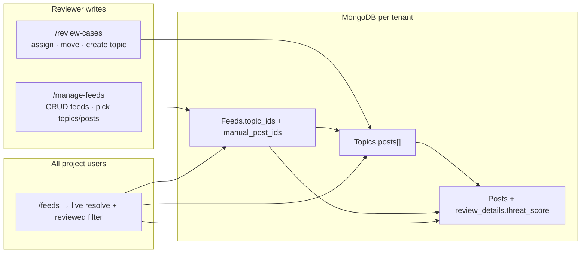
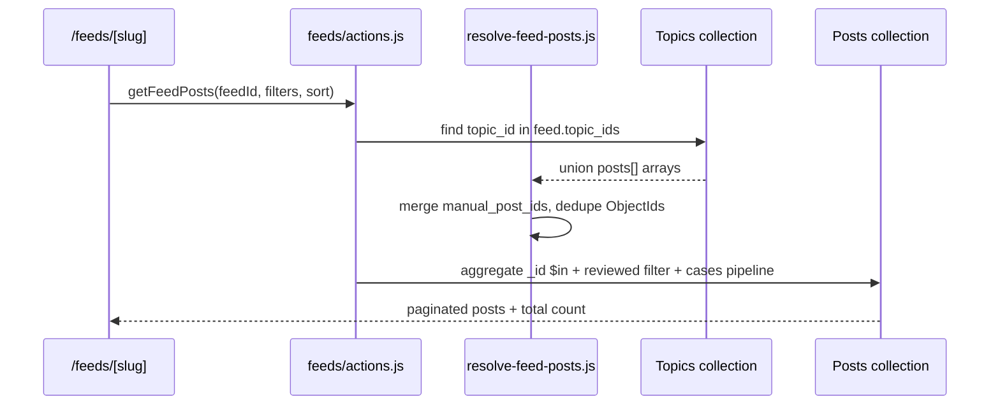

# Feeds & Topics — Implementation Guide

**Status:** Complete (reviewer **Manage Feeds**, client **Feeds** viewer, and **Review Cases topic assignment**).

**Last updated:** June 2026

---

## Table of contents

1. [Overview](#1-overview)
2. [Product decisions](#2-product-decisions)
3. [Architecture](#3-architecture)
4. [Data model](#4-data-model)
5. [How resolution works](#5-how-resolution-works)
6. [Routes & access control](#6-routes--access-control)
7. [Code map](#7-code-map)
8. [Deployment & database setup](#8-deployment--database-setup)
9. [Codebase review](#9-codebase-review)
10. [Known edge cases](#10-known-edge-cases)
11. [Manual test checklist](#11-manual-test-checklist)
12. [Future enhancements](#12-future-enhancements)

---

## 1. Overview

The feeds system lets reviewers curate themed collections of content for clients. A **feed** is a lightweight MongoDB document that references:

- **Topics** — groups of related posts (`Topics.posts[]`)
- **Manual posts** — individual cases added by search, outside any topic

Clients browse feeds at `/feeds` with the same filtering, detail panel, reports, and publishing-date chart behavior as `/cases`.

**Topic assignment** (at `/review-cases`) is the in-app **write path** for topic membership. Posts do not store a `topic_id`; membership lives on topic documents. When a reviewer assigns or moves a case to a topic, any feed that references that topic updates automatically on the next read — no writes to `Feeds` are required.



---

## 2. Product decisions

| Decision | Choice |
|----------|--------|
| Topic sync | **Live** — feeds reflect current `Topics.posts[]`; no frozen post snapshot on the feed document |
| Post eligibility (client view) | **Reviewed only** — `review_details.threat_score` must exist (same gate as `/cases`) |
| Topic inclusion | **Whole topic** — adding a topic to a feed includes all its posts (filtered to reviewed at read time) |
| Topic membership per post | **One topic per post** — enforced on assign/move; legacy multi-topic data is cleaned on next move |
| Feed visibility | **All users in project** — no per-user assignment or draft/publish toggle |
| Reviewer surfaces | `/manage-feeds` (feed CRUD), `/review-cases` (topic assignment) |
| Client surface | `/feeds` (index + detail) |

---

## 3. Architecture

### Read path (client feeds)

1. Load `Feeds` document by id or slug.
2. `resolveFeedPostObjectIds(feed)` — one `Topics` query for `topic_id ∈ feed.topic_ids`, union all `posts[]` with `manual_post_ids`, dedupe to `ObjectId[]`.
3. One `Posts` aggregation with `_id: { $in }` + cases pipeline (`buildCasesMatchQuery` includes reviewed filter) + filters/sort/facet.

### Write path (topic assignment)

1. Reviewer assigns/moves/creates topic from `/review-cases`.
2. `movePostToTopic` — `$pull` post hex id from **all** topics, `$addToSet` on target, `recomputeTopicStats` on affected topics.
3. `createTopicForPost` — allocate next `T#####` id, insert topic with `source: 'review-cases'`.
4. `deleteCase` — `removePostFromAllTopics` before hard-delete.

### Shared libraries

| Module | Role |
|--------|------|
| [`feed-schema.js`](../../src/lib/feeds/feed-schema.js) | Collection names, serializers, `sanitizeStringArray`, `escapeRegex` |
| [`resolve-feed-posts.js`](../../src/lib/feeds/resolve-feed-posts.js) | Live post resolution + feed-scoped aggregation pipelines |
| [`feed-slug.js`](../../src/lib/feeds/feed-slug.js) | URL slugs (`{title-slug}-{last8ofId}`) |
| [`topic-membership.js`](../../src/lib/feeds/topic-membership.js) | Pure DB helpers (move, stats, allocate id) |
| [`topic-membership-actions.js`](../../src/lib/feeds/topic-membership-actions.js) | Reviewer server actions for topic assignment |
| [`pipeline-helpers.js`](../../src/lib/posts/pipeline-helpers.js) | Shared cases/feed query builders (extracted from `cases/actions.js`) |

---

## 4. Data model

### `Feeds` collection

Auto-created on first `insertOne`. One collection per tenant MongoDB database (`project.mongo_db_map`).

**Sample:** [`sample_documents/mongodb/Feed.json`](../../sample_documents/mongodb/Feed.json)

```js
{
  _id: ObjectId,
  title: String,
  description: String,
  topic_ids: [String],        // e.g. "T00002" — references Topics.topic_id
  manual_post_ids: [String],  // Posts._id hex strings
  cover_image_url: String | null,
  created_by: String,         // reviewer email
  created_at: Date,
  updated_at: Date,
  update_history: [{ updated_at, updated_by, changes_summary }]
}
```

The feed stores **references only**. Post documents are never denormalized onto the feed.

### `Topics` collection

Introduced via external CSV import; first in-app mutations are topic assignment and feed consumption.

**Sample:** [`sample_documents/mongodb/topics.json`](../../sample_documents/mongodb/topics.json)

```js
{
  _id: ObjectId,
  topic_id: String,           // stable id, e.g. "T00002" (referenced by feeds)
  title: String,
  posts: [String],            // Posts._id hex strings (membership store)
  post_count: Number,         // denormalized; recomputed on membership change
  first_posted_at: Date,
  last_posted_at: Date,
  imported_at: Date,
  source: String              // e.g. "posts_ledger.csv" or "review-cases"
}
```

**Important:** Post → topic lookup is reverse: `Topics.findOne({ posts: hexId })`. There is no `topic_id` field on `Posts`.

### App-created topics

When a reviewer creates a topic from `/review-cases`:

- `topic_id` allocated as next `T#####` (zero-padded, e.g. `T00023`)
- `source: 'review-cases'`
- Post is sole initial member; any prior topic membership is cleared first

---

## 5. How resolution works



| Event | `Topics` | `Feeds` | `Posts` | Client `/feeds` |
|-------|----------|---------|---------|-----------------|
| Assign/move post to topic | `posts[]`, stats updated | No write | No change | Reflects on next read |
| Create topic + assign | New doc; old topic cleaned | No write | No change | Same |
| Add topic to feed | No change | `topic_ids` updated | No change | More posts on next read |
| Submit review | Unchanged | Unchanged | `review_details` etc. | Post may appear once reviewed |
| Delete case | Post pulled from all topics | `manual_post_ids` may orphan | Hard delete | Post disappears |

---

## 6. Routes & access control

| Route | Audience | Guard |
|-------|----------|-------|
| `/manage-feeds` | Reviewer | Fake 404 for non-reviewers; `requireRole(['reviewer'])` in actions |
| `/review-cases` | Reviewer | Same pattern |
| `/feeds` | All project users | `requireAuthContext()` |
| `/feeds/[feedId]` | All project users | Slug or raw ObjectId; redirects legacy ids to canonical slug |

**Sidebar** ([`Sidebar.js`](../../src/components/Sidebar.js)):

- **Feeds** — `show: true`
- **Manage Feeds** — `show: permission === 'reviewer'`

**Tenancy:** All Mongo access uses `dbName` from auth context (`mongo_db_map`). Never trust client-supplied database names.

**Permission note:** Admin UI may show `client-reviewer`; runtime checks use `'reviewer'`.

### Server actions summary

**Manage feeds** — [`manage-feeds/actions.js`](../../src/app/(dashboard)/manage-feeds/actions.js)

| Action | Description |
|--------|-------------|
| `listFeeds` | All feeds, sorted by `updated_at` |
| `getFeed` | Feed + hydrated topics + manual posts (editor) |
| `createFeed` / `updateFeed` / `deleteFeed` | CRUD |
| `searchTopics` | Title regex search; empty query returns recent topics |
| `searchPostsForFeed` | Hybrid Atlas text + vector search (reviewed-only) |

**Client feeds** — [`feeds/actions.js`](../../src/app/(dashboard)/feeds/actions.js)

| Action | Description |
|--------|-------------|
| `listFeedsForClient` | Feed index for all users |
| `getFeedById` | Metadata + slug |
| `getFeedPosts` | Paginated, filterable, reviewed-only list |
| `getFeedPostIds` | All matching ids (select-all, report export) |
| `getFeedPublishingHistogram` | Daily publish-date buckets |

**Topic assignment** — [`topic-membership-actions.js`](../../src/lib/feeds/topic-membership-actions.js)

| Action | Description |
|--------|-------------|
| `getTopicForPost` | Reverse lookup via `Topics.posts` |
| `assignPostToTopic` | Move to existing topic |
| `createTopicForPost` | New topic + assign |
| `clearPostTopic` | Remove from all topics (unassigned) |

---

## 7. Code map

```
src/
├── lib/
│   ├── feeds/
│   │   ├── feed-schema.js              # Serializers, collection constants
│   │   ├── feed-slug.js                # URL slug helpers
│   │   ├── resolve-feed-posts.js       # Live resolution + pipelines
│   │   ├── topic-membership.js         # Pure topic DB helpers
│   │   └── topic-membership-actions.js # Reviewer topic server actions
│   └── posts/
│       └── pipeline-helpers.js         # Shared cases/feed query builders
├── app/(dashboard)/
│   ├── manage-feeds/
│   │   ├── page.js                     # Reviewer index (404 guard)
│   │   ├── actions.js                  # Feed CRUD + searchTopics
│   │   ├── ManageFeedsClient.js        # Feed cards + delete
│   │   └── FeedBuilder.js              # Right slide-over create/edit
│   ├── feeds/
│   │   ├── page.js                     # Client feed index
│   │   ├── [feedId]/page.js            # Feed detail (filters, histogram)
│   │   ├── actions.js                  # Client read actions
│   │   ├── FeedsIndexClient.js         # Feed cards
│   │   ├── FeedContentList.js          # Cases-style table + CaseDetailPanel
│   │   └── PublishingHistogram.js      # Recharts horizontal bars
│   └── review-cases/
│       ├── TopicAssignmentSection.js   # Inline topic control
│       ├── TopicPickerPanel.js         # Nested slide-over picker
│       ├── ReviewDetails.js            # Wires TopicAssignmentSection
│       └── actions.js                  # deleteCase → removePostFromAllTopics
└── components/
    └── Sidebar.js                      # Feeds + Manage Feeds nav

scripts/
└── ensure_indexes.js                   # Posts + Topics indexes (per DB)

sample_documents/mongodb/
├── Feed.json
└── topics.json

docs/feeds/
└── manage-feeds-implementation-review.md   # This document
```

---

## 8. Deployment & database setup

### Prerequisites

| Requirement | Notes |
|-------------|-------|
| Per-tenant MongoDB | Each project has its own DB via Supabase `project.mongo_db_map` |
| `Topics` collection | Must exist with imported data **or** reviewers create topics from `/review-cases` |
| Atlas Search indexes | Required for feed post search in builder (same as `/cases` hybrid search) |
| App deploy | No Supabase schema migration for feeds/topics |

`Feeds` and app-created `Topics` documents are created at runtime. **No data migration script is required** for the feature itself.

### Required indexes

Run [`scripts/ensure_indexes.js`](../../scripts/ensure_indexes.js) on **every tenant database** that will use feeds/topics.

```bash
# From repo root, with .env.local pointing at the target tenant DB
node scripts/ensure_indexes.js
```

The script creates:

**Posts** (existing, still required):

| Index | Purpose |
|-------|---------|
| `{ processed: 1, "metadata.created_at": -1 }` | Review queue |
| `{ processed: 1, platform: 1, "metadata.created_at": -1 }` | Platform filter |
| `{ processed: 1, "metadata.sourcing_date": -1 }` | Sourcing date |
| `{ "analysis_results.risk_score": 1, "metadata.created_at": -1 }` sparse | AI analyzed filter |

**Topics** (new for feeds + topic assignment):

| Index | Options | Purpose |
|-------|---------|---------|
| `{ topic_id: 1 }` | **unique** | Feed resolution by `topic_ids`; safe topic id allocation |
| `{ posts: 1 }` | multikey | Reverse lookup `getTopicForPost`; bulk pull on delete/move |

### Multi-tenant index rollout

`ensure_indexes.js` uses a single `MONGO_DB_NAME` from `.env.local`. **Repeat for each project database:**

```bash
# Example: run once per tenant
MONGO_DB_NAME=acme_prod node scripts/ensure_indexes.js
MONGO_DB_NAME=contoso_prod node scripts/ensure_indexes.js
```

Or temporarily set `MONGO_DB_NAME` in `.env.local`, run the script, then switch to the next tenant.

> **Production tip:** Maintain a list of all `mongo_db_map` values from Supabase `project` and check them off as indexes are applied.

### Pre-flight checks (recommended before deploy)

Run these in each tenant DB **before** creating the unique `topic_id` index:

**1. Duplicate `topic_id` values** (unique index will fail):

```js
db.Topics.aggregate([
  { $group: { _id: '$topic_id', count: { $sum: 1 } } },
  { $match: { count: { $gt: 1 } } }
])
```

**2. Posts in multiple topics** (legacy import; app enforces single-topic on next move):

```js
db.Topics.aggregate([
  { $unwind: '$posts' },
  { $group: { _id: '$posts', topicCount: { $sum: 1 } } },
  { $match: { topicCount: { $gt: 1 } } },
  { $count: 'multiTopicPosts' }
])
```

**3. Topics referenced by feeds but missing** (orphan references — feeds skip gracefully):

```js
const feedTopicIds = db.Feeds.distinct('topic_ids')
const existing = db.Topics.distinct('topic_id')
feedTopicIds.filter(id => !existing.includes(id))
```

**4. Verify `Topics` exists** (empty collection is OK; feeds with only manual posts still work):

```js
db.getCollectionNames().includes('Topics')
```

### What you do **not** need

| Item | Reason |
|------|--------|
| Feeds collection migration | Created on first feed save |
| Posts schema change | Membership stays on `Topics.posts[]` |
| `revalidatePath('/feeds')` in deploy script | Live resolution; optional cache tuning only |
| Backfill `source` on imported topics | Optional metadata; not required for reads |

### Post-deploy smoke test

1. Reviewer: create a feed with one topic → save.
2. Reviewer: assign an unreviewed case to that topic → confirm topic `posts[]` updated.
3. Client: open `/feeds` → case should **not** appear until reviewed.
4. Reviewer: submit review with threat score → client feed shows the case.
5. Reviewer: move case to another topic → old feed loses it, new feed gains it on refresh.

---

## 9. Codebase review

### Strengths

- **Clean separation:** `topic-membership.js` (pure) vs server actions vs UI; `resolve-feed-posts.js` centralizes read logic.
- **Live sync model** is consistent across manage feeds, client feeds, and topic assignment — one source of truth (`Topics.posts[]`).
- **Reuse:** Cases pipeline, filters, `CaseDetailPanel`, `ReportGenerate`, and hybrid search avoid duplicate behavior.
- **Auth:** Reviewer mutations consistently use `requireRole(['reviewer'])`; client reads use `requireAuthContext()`.
- **Delete cascade:** `deleteCase` calls `removePostFromAllTopics` before hard-delete.
- **Slug URLs:** Human-readable feed URLs with legacy ObjectId redirect.
- **Legacy tolerance:** Multi-topic posts log a warning and return first match until next move.

### Issues & recommendations

| Severity | Finding | Recommendation |
|----------|---------|----------------|
| **Medium** | `post_count` / topic picker counts include **unreviewed** posts; client feeds show **reviewed-only** | Document for reviewers (see §10) or add `reviewed_post_count` later |
| **Medium** | `ensure_indexes.js` targets one `MONGO_DB_NAME` | Run per tenant before production (see §8) |
| **Medium** | Unique `Topics.topic_id` index fails if imports have duplicates | Run pre-flight aggregation; dedupe before index |
| **Low** | `loadFeedContext` loads **all feeds** to resolve slug suffix collisions | Fine at small scale; add `{ _id: regex }` query if feed count grows |
| **Low** | Feed mutations only `revalidatePath('/manage-feeds')`, not `/feeds` | Usually OK (dynamic reads); add `/feeds` revalidation if stale index pages appear |
| **Low** | `manual_post_ids` not pruned when a post is deleted | Orphan ids are harmless at read time; optional cleanup job later |
| **Low** | Topic title search is unindexed regex | Acceptable while topic count is modest |
| **Low** | `cover_image_url` on schema, no UI | Deferred feature |

### Security

No issues found beyond existing app patterns. Topic and feed mutations are reviewer-gated; tenant isolation flows through auth context `dbName`.

---

## 10. Known edge cases

### Unreviewed posts in topics

Reviewers can assign a topic **before** submitting review. The post is added to `Topics.posts[]` immediately but **does not appear** on `/feeds` until `review_details.threat_score` exists. Topic `post_count` in Manage Feeds may be higher than what clients see.

### Legacy multi-topic membership

CSV imports may place one post in multiple topics. `getTopicForPost` returns the first match and logs a warning. The next assign/move enforces single-topic membership.

### Deleted posts in `manual_post_ids`

If a post was manually added to a feed and later deleted, its id may remain in `manual_post_ids`. Resolution skips missing documents; no client-visible error.

### Empty feeds

A feed with no topics, no manual posts, or only unreviewed topic members shows an empty state on `/feeds`.

### Topic assignment timing vs review submit

Topic changes are **immediate** (not bundled with review form submit). Review submit does not touch topic membership.

---

## 11. Manual test checklist

### Access & navigation

- [ ] **Feeds** visible to all project users; **Manage Feeds** only for `reviewer`
- [ ] Non-reviewer `/manage-feeds` returns fake 404
- [ ] Unassigned project shows “Account Not Set Up”

### Manage Feeds (`/manage-feeds`)

- [ ] Create feed with title + description
- [ ] Search topics (empty query → recent; typed → title filter)
- [ ] Add whole topics; save; card shows topic count
- [ ] Search posts; add manual posts; save; card shows manual count
- [ ] Edit feed: hydrated topics + manual posts load
- [ ] Remove topic/post in builder; save persists
- [ ] Delete feed with confirm
- [ ] MongoDB `Feeds` doc shape matches schema (`update_history`, etc.)

### Client Feeds (`/feeds`)

- [ ] Index lists all feeds for project
- [ ] Feed detail loads with slug URL (legacy ObjectId redirects)
- [ ] Filters, sort, pagination match `/cases` behavior
- [ ] Publishing histogram renders; bar click sets date filter
- [ ] Case detail panel opens from row
- [ ] Report export with selected posts works
- [ ] Empty feed shows empty state

### Topic assignment (`/review-cases`)

- [ ] Unassigned post shows “Add topic”
- [ ] Search + assign existing topic → section updates
- [ ] Move to different topic → old topic `posts[]` updated, new topic gains post
- [ ] Create new topic → `T#####` doc with `source: 'review-cases'`
- [ ] Clear assignment → post unassigned; disappears from topic-only feeds
- [ ] Assign before review → not on client feed until reviewed
- [ ] After review → appears on feeds that include the topic
- [ ] Delete case → post removed from all topics; stats recomputed
- [ ] Non-reviewer cannot call topic actions (server-side)

### Cross-feature

- [ ] New topic from review-cases appears in Manage Feeds topic picker
- [ ] Feed with that topic shows post after review
- [ ] Moving post between topics updates client feeds without editing feed doc

---

## 12. Future enhancements

| Item | Notes |
|------|-------|
| Topic UI on `/cases` | CaseDetailPanel topic display/edit |
| `reviewed_post_count` on topics | Align picker counts with client view |
| Prune `manual_post_ids` on delete | Keep feed metadata tidy |
| `cover_image_url` picker | Field exists; no UI yet |
| Draft/publish feeds | Per-feed visibility control |
| Bulk topic assign | From review list view |
| Image/similar-post search in FeedBuilder | `getSimilarPosts` available |
| Multi-tenant index script | Loop all `mongo_db_map` values automatically |

---

## Summary

Feeds and topics form a **live, reference-based curation layer** on top of existing `Posts` and cases infrastructure. Reviewers build feeds from topics and hand-picked posts; assign cases to topics during review; clients browse the result with full cases-list capabilities. **Deployment requires per-tenant MongoDB indexes on `Topics` (especially `topic_id` unique and `posts` multikey)** — run `node scripts/ensure_indexes.js` for each project database before go-live.
