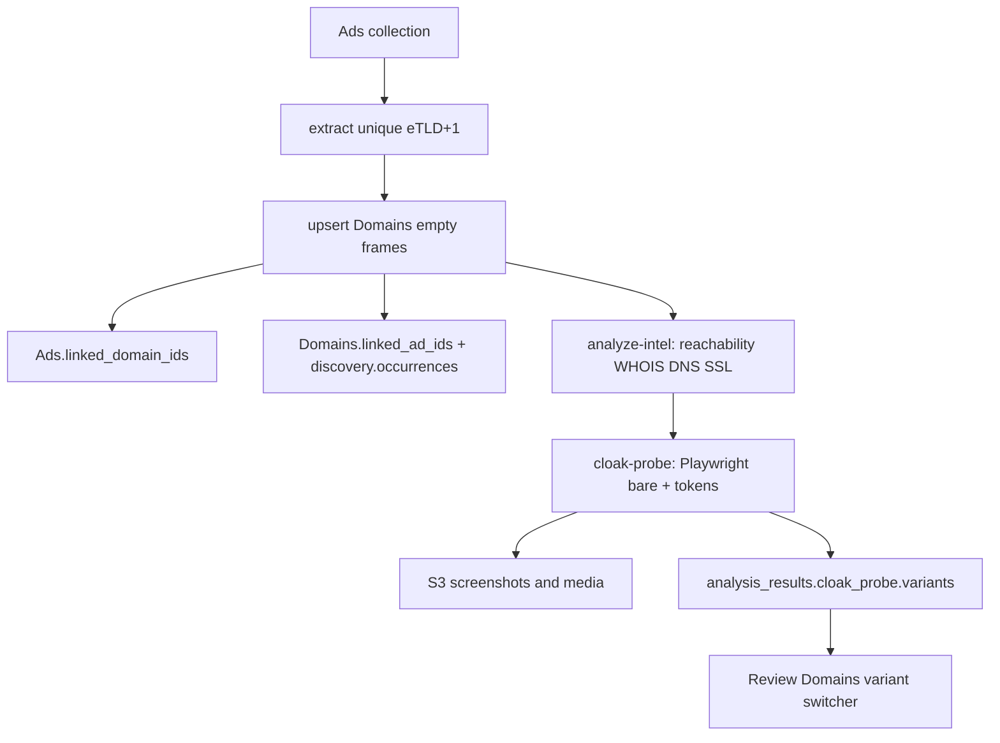

# SEBI Ads → Domains Cloak Pipeline

**Date:** 2026-08-24 (ops run) / documented 2026-08-25  
**Tenant DB:** `SEBI-Data-Search`  
**Working copy of scripts:** this directory (`scripts/`)  
**Live ops copy (where we ran):** `/Users/tempus/Desktop/overwatch/tmp/sebi-ads-domain-report/`  
**Domain analyzer:** `/Users/tempus/Desktop/overwatch/Data_pipeline_test/domain_analyzer`

This package documents the one-off SEBI investigation that:

1. Extracted unique landing domains from Meta ads
2. Seeded empty `Domains` review frames with Ads ↔ Domains links
3. Ran infrastructure-only analysis (reachability / WHOIS / DNS / SSL / hosting)
4. Probed known cloak query params with Playwright, capturing screenshots + media per URL variant
5. Surfaced openable `domain + search-param` links in Review Domains / Domains UI

---

## Problem

Scam ads often land on third-party domains that **cloak**:

| URL | What renders |
|-----|----------------|
| `https://mowdmcporvx.com/` | Dummy “luxury watch / exhibition” shell |
| `https://mowdmcporvx.com/?pEl8X=MI1_HT2` | Fraud investment / Quantum AI lander |
| `https://mowdmcporvx.com/?pEl8X=ajtan_Haq` | Same or related scam creative |
| `https://mowdmcporvx.com/?pEl8X=MI2_HT2` | **Different** scam creative |

Without the right key/value, reviewers only see the dummy site. We needed to:

- Inventory destinations from ads (`content.link_url` + `content.cards[].link_url`)
- Persist domains for review
- Collect infra facts even when content is cloaked
- Systematically try known unlock tokens and **store each variant** (screenshot, media, exact URL)

---

## Architecture



**Identity rule:** one `Domains` document per registrable domain (eTLD+1). Query-string landers are **variants** on that document, not separate docs.

---

## Prerequisites

```bash
# Python env with pymongo, playwright, requests, etc.
/Users/tempus/Desktop/overwatch/Data_pipeline_test/.venv/bin/python

# Mongo + AWS from Data_pipeline_test/.env
#   MONGO_URI=...
#   DB_NAME overridden per CLI --db SEBI-Data-Search
#   S3 credentials for domain-analyzer/ uploads

export PIPELINE_ROOT=/Users/tempus/Desktop/overwatch/Data_pipeline_test
cd docs/ops/sebi-ads-domain-cloak-pipeline/scripts
```

Optional: `playwright install chromium` if browser binaries are missing.

---

## CLI commands (what we ran)

All commands use the pipeline venv and `SEBI-Data-Search`.

```bash
PY=/Users/tempus/Desktop/overwatch/Data_pipeline_test/.venv/bin/python
cd /Users/tempus/Desktop/overwatch/tmp/sebi-ads-domain-report   # live run dir
# or: cd docs/ops/sebi-ads-domain-cloak-pipeline/scripts

# 1) Dry-run extract (read-only) → out/unique_domains*.json|csv
$PY cli.py extract --db SEBI-Data-Search

# 2) Upsert empty Domains frames + bidirectional Ads links (no analysis)
$PY cli.py apply --db SEBI-Data-Search

# 3) Intel-only: online check + DNS/WHOIS/SSL/hosting (no page content)
$PY cli.py analyze-intel --db SEBI-Data-Search
# optional smoke: --limit 2

# 4) Cloak probe with screenshots + media for every bare + token URL
$PY cli.py cloak-probe --db SEBI-Data-Search --domains mowdmcporvx.com   # smoke
$PY cli.py cloak-probe --db SEBI-Data-Search                             # all reachable
```

Artifacts land in `./out/` relative to the CLI cwd (for the live run: `tmp/.../out/`). Samples of those outputs are under [`samples/`](./samples/).

---

## Results snapshot (SEBI-Data-Search)

| Step | Result |
|------|--------|
| Ads scanned | ~4,590 |
| Destination URLs seen | ~29,805 |
| Unique landers kept | **132** (skipped amazon / social / etc.) |
| Domains after upsert | **133** (incl. prior fixtures) |
| Intel: up / down | **87** / **46** |
| Cloak probe (reachable only) | **87** probed, all with screenshots |
| Unlocked (param changes content) | **64** |
| Multi-creative domains | **41** |

Skipped hosts (brand/social): see [`samples/skipped.json`](./samples/skipped.json).  
Known unlock tokens: [`known_cloak_params.txt`](./known_cloak_params.txt).

---

## Script map

| File | Role |
|------|------|
| [`scripts/cli.py`](./scripts/cli.py) | `extract` / `apply` / `analyze-intel` / `cloak-probe` |
| [`scripts/sebi_report/extract.py`](./scripts/sebi_report/extract.py) | Harvest URLs from Ads; canonicalize eTLD+1 |
| [`scripts/sebi_report/skip_hosts.py`](./scripts/sebi_report/skip_hosts.py) | Social / CDN / major-brand skip list |
| [`scripts/sebi_report/apply.py`](./scripts/sebi_report/apply.py) | Empty Domains upsert + M2M links |
| [`scripts/sebi_report/analyze_intel.py`](./scripts/sebi_report/analyze_intel.py) | Batch call `domain_analyzer.pipeline.analyze_one(..., intel_only=True)` |
| [`scripts/sebi_report/cloak_tokens.py`](./scripts/sebi_report/cloak_tokens.py) | Known `pEl8X` / `ad_name` / `adset_name` pairs |
| [`scripts/sebi_report/cloak_probe.py`](./scripts/sebi_report/cloak_probe.py) | Playwright bare+tokens; S3 screenshot/media; Mongo write |

Also see:

- [`SCHEMA.md`](./SCHEMA.md) — `cloak_probe` / `discovery.variant_urls` shape  
- [`MANUAL-COMMANDS.md`](./MANUAL-COMMANDS.md) — one-off Python snippets we ran outside the CLI  
- [`UI-CHANGES.md`](./UI-CHANGES.md) — overwatch_client Review Domains / Domains UI  

---

## Mongo fields written

### Bidirectional link

- `Ads.linked_domain_ids: ObjectId[]`
- `Domains.linked_ad_ids: ObjectId[]`
- `Domains.discovery.occurrences[]` with `entity_type: "ad"`, exact URL

### After intel

- `workflow.visibility_status`: `up` | `down`
- `list.is_reachable`, registrar / hosting / SSL denorm
- `analysis_results.whois|dns|ssl|hosting|redirect_chain` (no real page content)

### After cloak probe

- `analysis_results.cloak_probe.variants[]` — one entry per bare/token URL with `url`, `kind`, `screenshot`, `media`, `page_text`
- `analysis_results.cloak_probe.creatives[]` — grouped by content hash; shared media; list of unlock `urls` / `params`
- `discovery.variant_urls[]` — `{ url, param, kind, label }` for quick “open this lander”
- Primary `analysis_results.screenshot` / `media` / `page_text` / `content_classification` = **best unlocked scam** (or bare if none)

Domains stayed `workflow.review_status: pending` so they appear on **Review Domains**, not the client `/domains` list until reviewed.

---

## Related contracts / code

- Domains contract: [`docs/contracts/domains-schema-v1.md`](../../contracts/domains-schema-v1.md)
- Domain analyzer PRD: [`docs/prd/domain-analyzer-module.md`](../../prd/domain-analyzer-module.md)
- Analyzer implementation: `Data_pipeline_test/domain_analyzer/` (`pipeline.py`, `capture.py`, `media.py`, `writer.py`, `identity.py`)

---

## Re-running later

1. Point `PIPELINE_ROOT` at `Data_pipeline_test` and use its `.venv`.
2. `extract` → review `out/unique_domains.csv` / `skipped.json`.
3. `apply` (idempotent `$addToSet` links; does not wipe intel).
4. `analyze-intel` for pending/failed only (or `--all`).
5. `cloak-probe` for reachable hosts (overwrites `cloak_probe` + primary screenshot/media).

Do **not** run an old text-only probe concurrently with a capture probe — stop the older process first so it cannot overwrite rich variants.
