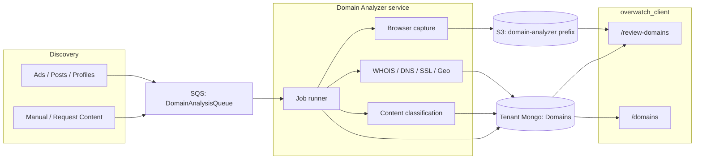

# PRD: Domain Analyzer Module

**Status:** Draft  
**Owner:** Domain-analyzer service (external; not part of `overwatch_client`)  
**Consumers:** Overwatch review UI (`/review-domains`, `/domains`), tenant Mongo `Domains` collection  
**Related contracts:** [`docs/contracts/domains-schema-v1.md`](../contracts/domains-schema-v1.md)  
**Reference captures:** `newzonic.com`, `mezaxs.com`, `noiverjio34.com` (see `sample_documents/mongodb_schema/Domains*.json`)

---

## 1. Problem

Overwatch already reviews **posts** and **ads**. A large share of those creatives land on **third-party domains**: investment scams spoofing news sites, cloaked lead-gen farms, freshly registered Cloudflare landers, and query-param gated pages (`pEl8X=…`, `content_id=…`).

The Next.js app can **queue, display, and human-review** a `Domains` document. It cannot **fetch the live site, resolve WHOIS/DNS/SSL/hosting, screenshot the page, extract copy, or archive media**. That work belongs in a **standalone Domain Analyzer service**.

Until that service exists, the UI is seeded with fixture documents. This PRD specifies the production module that replaces those fixtures.

---

## 2. Product goal

Build an **external Domain Analyzer** that:

1. Accepts a discovered URL (from an ad, post, profile, or manual submit).
2. Canonicalizes the registrable domain (eTLD+1) and upserts one `Domains` document per domain.
3. Captures the **exact URL variant** (query string matters).
4. Collects infrastructure facts (WHOIS, DNS, SSL, hosting/geo, redirects, tech stack).
5. Extracts **page text** (title, description, headings, paragraphs) and classifies content.
6. Archives a **full-page screenshot** and **on-page media** (images, video) into a **dedicated S3 prefix/bucket**.
7. Writes a UI-compatible `analysis_results` payload plus denormalized `list.*` / `workflow.analysis_status`.
8. Never overwrites human `review_details`.

Reviewers then work in existing Overwatch surfaces. Clients only see domains after `workflow.review_status: "reviewed"`.

---

## 3. Non-goals

- Building review UI, auth, tenant routing, or report export (already in `overwatch_client`).
- Replacing the posts/ads content-moderation worker.
- Live takedown execution (analyzer may *flag*; takedown is a client workflow).
- Storing a full HTML dump of every page as the primary artifact (optional, size-capped, in `raw` or a separate object).
- Treating `www.` / path / query as separate domain identities. Identity is **eTLD+1**; variants live under discovery + capture runs.

---

## 4. Users and jobs-to-be-done

| Actor | Job |
|-------|-----|
| Ingest / ad-scrape | “When we see a landing URL, enqueue domain analysis.” |
| Reviewer | “Open `/review-domains`, see screenshot + infra + extracted copy, write a verdict.” |
| Client | “On `/domains`, see reviewed domains with score, category, registrar, hosting country.” |
| Analyst / legal | “Download archived screenshot and media for evidence.” |

---

## 5. System context

The analyzer is a **separate service** (worker + optional HTTP API). It shares **tenant MongoDB** and **AWS** with Overwatch. It does not import Next.js code.



**Golden rule (same as posts/ads workers):** the analyzer owns `analysis_results`, `workflow.analysis_status`, and derived `list.ai_*` / registrar / hosting / reachability fields. It **must not** write `review_details`, `list.review_*`, `workflow.review_status` (except leaving it `pending` on first insert), client status, or takedown decisions.

---

## 6. Trigger contract

Mirror the content-moderation worker: JSON on SQS (or equivalent queue).

### 6.1 Message

```json
{
  "db_name": "PMO-Data-Search",
  "collection_name": "Domains",
  "object_id": "6a85448b3566f8fa2bfe307f",
  "url": "https://mezaxs.com/?pEl8X=szvnknir",
  "mode": "full"
}
```

| Field | Required | Notes |
|-------|----------|--------|
| `db_name` | yes | Tenant database |
| `collection_name` | yes | Always `"Domains"` |
| `object_id` | yes if doc exists | Mongo `_id`. If omitted, analyzer upserts by `domain_name` then writes `_id` back into the message log |
| `url` | yes | **Exact** discovered URL including scheme, path, query |
| `mode` | no | `full` (default) or `recapture` (screenshot/media/text only; keep WHOIS unless stale) |
| `entity_type` / `entity_id` | no | Append to `discovery.occurrences[]` |

### 6.2 When to enqueue

| Source | Behavior |
|--------|----------|
| Ad / post / profile ingest with outbound URL | Upsert `Domains` (`analysis_status: pending`), append occurrence, send SQS |
| Manual “Request content” / domain paste | Same |
| Reviewer “Re-run analysis” (future UI) | `mode: full` or `recapture`; blocked if a correction is in flight |

Dedup: unique index `{ domain_name: 1 }`. Re-sightings **must not** create a second document. They append `discovery.occurrences` and may trigger a new analysis run if the URL variant is new or last analysis is older than a TTL (recommended: 7 days, or immediately if query string differs).

---

## 7. Identity and discovery

Canonical identity:

- Lowercase, punycode (IDNA) **eTLD+1** (`mezaxs.com`, not `www.mezaxs.com`, not the full URL).
- `discovery.first_seen_url` and each `occurrences[].url` keep the **raw** URL (query params are evidence of cloaking / lander routing).

This matches how `newzonic.com` vs `mezaxs.com/?pEl8X=szvnknir` vs `noiverjio34.com/?content_id=…&pEl8X=…` were handled in fixtures.

---

## 8. Capture pipeline (the hard part)

### 8.1 URL variants

Analyze the **submitted URL**, not just `https://{domain}/`.

Observed in fixtures:

| Domain | Variant | What rendered |
|--------|---------|----------------|
| `newzonic.com` | `content_id` + `utm_creative` | India Today spoof / Quantum AI |
| `mezaxs.com` | `pEl8X=szvnknir` | Times of India spoof / Quantum AI (HTML served even to simple HTTP clients) |
| `noiverjio34.com` | same `pEl8X` + `content_id` | **Cloaked.** Bots/headless often get a watch lead-gen template (`RagaHorology`); a real browser with the param can get the scam. Pre-JS `<title>` was `loading`. Loader at `/lander/lead_loader/` fingerprinted WebGL/canvas/wasm. |

**Requirement:** preserve query string; record `cloak_param` / tracking params; store `lander_path` / `base_href` when present.

### 8.2 Browser capture

Minimum viable capture:

1. Resolve HTTP(S) with redirects; record `redirect_chain[]` (`url`, `status_code`).
2. Load in a **real Chromium** (not curl-only) with a desktop viewport (e.g. 1440×900), then **full-page screenshot**.
3. Wait for network idle **and** a title other than `loading` / empty, with a timeout (e.g. 20s).
4. Collect response headers (`server`, `x-powered-by`, cookies, pixels).

**Anti-cloaking (required, not optional):**

- Prefer a headed or stealth-capable browser; plain headless often fails (see `noiverjio34.com`).
- If the first render looks like a generic lead-gen / watch / “loading” shell **and** the inbound URL has ad/cloak params, run a **second capture path** (different UA, no `HeadlessChrome`, optional residential-like fingerprint). Store **both** variants under `analysis_results.capture.variants[]`.
- Classify as `cloaking` when title/path/`content_id` disagree with rendered copy, or when pre-JS title ≠ post-JS title.

If capture fails: `workflow.analysis_status: "failed"`, `analysis_results.capture.error`, still persist WHOIS/DNS/SSL if those succeeded. Partial success is better than an empty doc.

### 8.3 Full-page screenshot

- PNG (or WebP if quality ≥ full-page PNG at similar fidelity).
- Full document height (fixtures used ~1440×5000).
- Upload to S3 (see §10).
- Write `analysis_results.screenshot`:

```js
{
  s3_url: "https://{bucket}.s3.{region}.amazonaws.com/domain-analyzer/{db_name}/{domain_name}/{run_id}/screenshot/full.png",
  captured_at: ISODate,
  source_url: "https://mezaxs.com/?pEl8X=szvnknir",
  width: 1440,
  height: 5000,
  content_type: "image/png",
  sha256: "…"
}
```

**UI compatibility:** `overwatch_client` signs `analysis_results.screenshot.s3_url` when the host contains `amazonaws.com` (`getSignedImageUrl`). Store a **full HTTPS S3 URL**, not a bare key. Paths starting with `/` are treated as public app assets (fixtures only). Production must not use `/fixtures/…`.

### 8.4 On-page media archive

Walk the rendered DOM (and CSS `background-image` where cheap) and download:

| Kind | Sources |
|------|---------|
| Images | ``, `srcset` largest candidate, Open Graph / Twitter images, favicon (optional) |
| Video | `<video src>`, `<source>`, obvious MP4/WebM in the lander |

Skip: tracking pixels 1×1, data-URIs over a size cap, `about:` / `blob:` that cannot be fetched, third-party ad-network sprites if they fail (log skip reason).

For each asset:

1. Fetch with the page’s cookies / referrer if needed.
2. Hash (`sha256`) for dedup within the run and across runs of the same domain.
3. Upload to S3 under the run’s `media/` folder.
4. Record metadata on the document.

Cap (recommended v1): 30 images, 5 videos, 15 MB per file, 80 MB per run. Overflow is listed in `media.skipped[]` with reason `limit`.

---

## 9. Analysis modules (what the fixtures already proved we need)

Each key under `analysis_results` is a **module**. Full-replace that module per run; do not rename shipped keys without bumping `schema_version`.

The review UI already renders: `whois`, `dns`, `ssl`, `hosting`, `reputation`, `content_classification`, `tech_stack`, `redirect_chain`, `screenshot`. Unknown keys dump as JSON. New modules (`page_text`, `media`, `capture`) are additive and UI-safe.

### 9.1 WHOIS — `analysis_results.whois`

| Field | Example (mezaxs) |
|-------|------------------|
| `registrar`, `registrar_iana_id` | NameCheap, Inc. / 1068 |
| `created_at`, `updated_at`, `expires_at` | ISO dates |
| `registrant_country` | `IS` (privacy proxy) |
| `privacy_protected`, `privacy_provider` | true / Withheld for Privacy ehf |
| `name_servers[]` | Cloudflare NS |
| `dnssec` | boolean |
| `age_days_at_analysis` | integer |

Denormalize `list.registrar`.

### 9.2 DNS — `analysis_results.dns`

`a[]`, `aaaa[]`, `mx[]`, `ns[]`, `txt[]`, `nameservers[]`.

### 9.3 SSL — `analysis_results.ssl`

`issuer`, `subject`, `valid_from`, `valid_to`, `is_valid`, `san[]`.  
Denormalize `list.ssl_valid`.

### 9.4 Hosting / geo — `analysis_results.hosting`

This is the “server location” the UI already shows.

| Field | Notes |
|-------|--------|
| `ip` | Prefer a resolved A record (Cloudflare anycast is still the edge IP) |
| `asn` | e.g. `AS13335` |
| `provider` | e.g. Cloudflare, Inc. |
| `country`, `city` | GeoIP of the **edge IP** (document that CDN hides origin) |
| `is_cdn`, `anycast` | booleans |

If origin IP can be obtained (direct DNS, historical, or TLS), store `origin_ip` separately and do **not** overwrite `ip` without labeling. Denormalize `list.hosting_provider`, `list.hosting_country`.

### 9.5 Reputation — `analysis_results.reputation`

`hits[]`, `sources[]`, `notes`. Empty hits are valid; fixtures used notes to explain that **age + content** carried the risk, not blocklists.

### 9.6 Content classification — `analysis_results.content_classification`

Must stay the primary card the UI already paints (title, summary, category, language, spoofed brands, POIs, labels).

Required:

```js
{
  url, http_status, title, language,
  category,          // phishing | counterfeit | gambling | adult | malware | scam | benign | unknown | …
  labels: [],        // poi_impersonation, news_spoof, investment_scam, lead_gen, lander_farm, cloaking, …
  poi_names: [],
  spoofed_brands: [],
  lander_path,       // e.g. /lander/saw-drill-hammer-axe-chisel-plane-file-rasp/index.php
  ad_content_id,     // from query if present
  cloak_param,       // e.g. pEl8X=szvnknir
  summary,           // 2–6 sentences for reviewers
  excerpt            // short quote from the page
}
```

Threat types used in fixtures (copy into `list.threat_types` / `list.violation_flags`):  
`impersonation`, `financial_scam`, `poi_misuse`, `cloaking`, `ad_fraud`, `brand_impersonation`.

Also extract when present (may live in `raw` if not first-class): Facebook Pixel / GTM IDs, contact email/phone/WhatsApp/address, cookies.

### 9.7 Page text — `analysis_results.page_text` (new, required)

Structured extraction from the **rendered** DOM (post-JS), not only raw HTML.

```js
{
  title: "",                 // document.title
  meta_description: "",      // <meta name="description">
  og_title: "",
  og_description: "",
  canonical_url: "",
  headings: [
    { tag: "h1", text: "…" },
    { tag: "h2", text: "…" }
  ],
  paragraphs: [ "…" ],       // visible <p> text, trimmed, de-duped
  language: "en"
}
```

Limits (v1): 30 headings, 40 paragraphs, 500 chars per paragraph, 20k chars total. Drop boilerplate nav/footer if a simple allowlist of `main` / `article` exists; otherwise keep document order.

`content_classification.title` **must equal** `page_text.title` (or `og_title` if title is `loading`). `excerpt` should be drawn from headings/paragraphs.

### 9.8 Tech stack — `analysis_results.tech_stack`

Array of short tokens: `cloudflare`, `php_7.4`, `facebook_pixel`, `caddy`, `google_fonts`, …

### 9.9 Redirect chain — `analysis_results.redirect_chain`

`[{ url, status_code }]`. HTTP→HTTPS 301 is expected and must be recorded (`noiverjio34.com`).

### 9.10 Capture metadata — `analysis_results.capture` (new)

```js
{
  run_id: "uuid",
  captured_at,
  user_agent,
  headless: false,
  viewport: { width: 1440, height: 900 },
  pre_js_title: "loading",
  post_js_title: "…",
  final_url: "https://…",
  variants: [
    { label: "automated", title: "RagaHorology …", screenshot_s3_url: "…" },
    { label: "anti_cloak", title: "…", screenshot_s3_url: "…" }
  ],
  error: null
}
```

The **primary** screenshot (the one reviewers see first) is still `analysis_results.screenshot` — pick the variant that looks like the **inbound ad’s intended lander** when they disagree.

### 9.11 Media — `analysis_results.media` (new, required)

```js
{
  images: [
    {
      source_url: "https://mezaxs.com/lander/…/hero.jpg",
      s3_url: "https://{bucket}.s3.{region}.amazonaws.com/domain-analyzer/.../media/{sha256}.jpg",
      content_type: "image/jpeg",
      bytes: 184320,
      width: 1200,
      height: 630,
      sha256: "…",
      alt: "",
      in_og: true
    }
  ],
  videos: [
    {
      source_url: "https://…/promo.mp4",
      s3_url: "https://…/media/{sha256}.mp4",
      content_type: "video/mp4",
      bytes: 2500000,
      sha256: "…"
    }
  ],
  skipped: [
    { source_url: "…", reason: "pixel" | "limit" | "fetch_failed" | "unsupported" }
  ]
}
```

Store **HTTPS S3 URLs** so a future UI can reuse `getSignedImageUrl`.

### 9.12 Raw — `analysis_results.raw`

Trimmed leftovers: `server`, `x_powered_by`, `facebook_pixel_id`, `base_href`, `cookies_observed[]`, `contact{}`. Do not dump full HTML here.

---

## 10. S3 layout (use-case specific)

**Dedicated prefix** (preferred if sharing the existing Overwatch bucket):

```
domain-analyzer/
  {db_name}/
    {domain_name}/
      {run_id}/
        screenshot/
          full.png
          variant-{label}.png          # optional
        media/
          {sha256}.{ext}
        optional/
          rendered.html.gz             # only if enabled, ≤ 2 MB compressed
```

Alternatively a **dedicated bucket** `overwatch-domain-analyzer` with the same key structure.

Rules:

- Private objects; Overwatch continues to sign GET URLs (1h).
- Same AWS account/region as existing media if possible so `AWS_BUCKET_NAME` + `getSignedImageUrl` work without client code changes. If a **new** bucket is used, the client must be taught to sign that bucket — call that out in the implementation ticket.
- Lifecycle: expire `optional/` HTML after 90 days; keep screenshot + media for evidence (no auto-delete in v1).
- Object metadata: `domain_name`, `run_id`, `db_name`, `sha256`.

---

## 11. MongoDB document (UI-compatible)

Collection: `Domains`  
`schema_version: 1`  
Unique: `{ domain_name: 1 }`

Analyzer **insert/upsert** shape (fields it may write):

```js
{
  schema_version: 1,
  domain_name: "mezaxs.com",

  discovery: {
    first_entity_type, first_entity_id, first_seen_url,
    occurrences: [{ entity_type, entity_id, url, seen_at }]
  },

  workflow: {
    analysis_status: "pending" | "running" | "completed" | "failed",
    review_status: "pending",          // only on insert; never set to reviewed
    client_status: "open",             // only on insert
    visibility_status: "up" | "down" | "parked" | "unknown",
    takedown_status: "none",           // only on insert
    alerted_at: null
  },

  list: {
    ai_threat_score,                   // 0–100
    review_threat_score: null,         // do not set
    effective_threat_score,            // review_threat_score ?? ai_threat_score
    risk_rank,                         // high >95, medium >75, low >40, else safe
    threat_types: [],
    violation_flags: [],               // same as threat_types for list filters
    category,
    registrar, hosting_provider, hosting_country,
    is_reachable, ssl_valid,
    first_seen_at, last_seen_at, last_analyzed_at,
    reviewed_at: null,                 // do not set
    occurrence_count
  },

  analysis_results: { /* modules in §9 */ },

  ingestion: { type, source_url, ingested_at },
  system: { created_at, updated_at }
}
```

On **updates**, use `$set` on analyzer-owned paths only. Do not `$unset` `review_details`.

`case_events`: `entity_type: "domain"`, `source: "domain_analyzer"`, e.g. `analysis_completed` / `analysis_failed`.

Indexes (already recommended in the v1 contract): unique `domain_name`; review queue `{ workflow.review_status, list.last_analyzed_at }`; `{ list.risk_rank, list.last_seen_at }`; `{ discovery.occurrences.entity_id }`.

### Scoring (v1 heuristic, replaceable by a later model)

Signals that drove fixture scores (84–94):

- Domain age &lt; 180 days  
- WHOIS privacy  
- CDN lander path (`/lander/…`)  
- News-org / bank / political POI impersonation  
- Investment return claims + lead form  
- Cloaking / `content_id` mismatch  
- Tracking pixel on a “news” page  

`list.ai_threat_score` is integer 0–100. `risk_rank` uses the same `RISK_THRESHOLDS` as posts/ads (`>95` high, `>75` medium, `>40` low).

---

## 12. Compatibility with `overwatch_client` (do not break)

| Client behavior | Analyzer must |
|-----------------|---------------|
| `normalizeDomainForUi` reads `domain_name`, `discovery`, `workflow`, `list`, `analysis_results`, `screenshot.s3_url` | Keep these paths |
| Screenshot: `/` public path **or** `amazonaws.com` signed | Production: full S3 HTTPS URL |
| `DomainAnalysisResults` cards: title/summary, WHOIS, hosting/SSL, DNS, tech badges, redirect chain, reputation notes | Populate those modules |
| Unknown `analysis_results` keys render as JSON | Additive modules OK |
| `/review-domains` queue: `workflow.review_status` pending | Leave pending until human review |
| `/domains` list: `workflow.review_status === "reviewed"` | Never mark reviewed |
| Review submit writes `review_details` (threat_score, flags, legal_codes, poi_names, is_aigc, reasoning, …) | Never touch that object |
| `effective_threat_score` / `risk_rank` | On analyzer write: `review_threat_score ?? ai_threat_score`. If `list.review_threat_score` already exists, **do not overwrite it**; still refresh `ai_threat_score` |

Human review form already matches ads/posts (visibility, risk buckets, project violation labels, AIGC, legal codes, POI, reasoning). Analyzer should **pre-fill** `content_classification.poi_names` and `labels` so reviewers start from AI suggestions, not a blank page.

---

## 13. Functional requirements

| ID | Requirement | Priority |
|----|-------------|----------|
| DA-1 | Upsert by canonical `domain_name`; append discovery occurrences | P0 |
| DA-2 | Analyze the exact input URL (scheme, path, query) | P0 |
| DA-3 | WHOIS + DNS + SSL + hosting geo | P0 |
| DA-4 | Redirect chain + reachability | P0 |
| DA-5 | Headed/stealth browser full-page screenshot → S3 | P0 |
| DA-6 | Extract title, meta description, H1–H3, paragraphs | P0 |
| DA-7 | Content classification + summary + excerpt + category + threat types | P0 |
| DA-8 | Download images/video from the page → S3 `media/` | P0 |
| DA-9 | Write UI-compatible Mongo fields; never `review_details` | P0 |
| DA-10 | Anti-cloak second capture when loader/`loading`/mismatch detected | P1 |
| DA-11 | Record pixels, lander_path, cloak_param, tech_stack | P1 |
| DA-12 | Reputation feeds (blocklists) | P2 |
| DA-13 | Origin IP behind CDN | P2 |
| DA-14 | Optional gzipped HTML in S3 | P2 |
| DA-15 | Recapture mode without full intel refresh | P2 |

---

## 14. Operational requirements

- Idempotent runs: same `object_id` + `mode: full` replaces `analysis_results` modules and updates `list.last_analyzed_at`.
- Timeouts: intel 15s each; browser 45s; media fetch 10s/file.
- Retries: SQS visibility timeout ≥ 2× max run; 2 retries then `analysis_status: failed`.
- Observability: structured logs with `db_name`, `domain_name`, `run_id`, `final_url`, capture variant used. Optional `case_events` on complete/fail.
- Legal: only store what reviewers need; no credential stuffing; robots/ToS — this is a **defensive OSINT** pipeline for tenant investigations, not a general crawler.

---

## 15. Success criteria

- A new URL like `https://mezaxs.com/?pEl8X=szvnknir` becomes a `/review-domains` row with screenshot, WHOIS, hosting country, extracted title/headings, and archived images **without** a fixture JSON.
- Cloaked hosts (`noiverjio34.com` family) either capture the **ad-intended** lander or persist **two variants** plus a `cloaking` label — not a silent watch-template as the only truth.
- Reviewer can complete the existing review form; client `/domains` still only shows reviewed docs.
- Media and screenshots load in the UI via existing S3 signing.

---

## 16. Phased delivery

**Phase 0 — Contract freeze (this PRD + schema v1 modules)**  
Lock `analysis_results` keys; add `page_text`, `media`, `capture`.

**Phase 1 — Intel + Mongo writer**  
WHOIS/DNS/SSL/hosting, upsert, `list.*`, no browser.

**Phase 2 — Browser + screenshot + page_text**  
Full-page PNG, title/H/P extraction, classification.

**Phase 3 — Media archive + anti-cloak**  
S3 `media/`, variant captures, cloaking labels.

**Phase 4 — UI polish (overwatch_client, separate PR)**  
Gallery for `analysis_results.media`, heading list for `page_text`, variant switcher.

---

## 17. Open questions

1. Shared Overwatch bucket + `domain-analyzer/` prefix vs dedicated bucket (signing in client).
2. Whether `recapture` is reviewer-triggered in UI in v1 or ops-only.
3. Max media retention / PII in lead-gen screenshots (faces, form fields).
4. Whether classification is rules-first (fixture-quality) or LLM-assisted like the posts worker.

---

## 18. Appendix — fixture → module mapping

| Fixture insight | Module field |
|-----------------|--------------|
| Namecheap + privacy + young domain | `whois.*`, `list.registrar`, `age_days_at_analysis` |
| Cloudflare anycast SF / US | `hosting.ip/asn/provider/country/city/is_cdn` |
| Let's Encrypt / GTS certs | `ssl.*`, `list.ssl_valid` |
| Quantum AI + TOI / India Today spoof | `content_classification` + `page_text` |
| POIs (Shah, Murmu, Sitharaman, Murthy, …) | `content_classification.poi_names` |
| `pEl8X=szvnknir` | `cloak_param`, keep full URL in discovery |
| `/lander/…` PHP 7.4 | `lander_path`, `tech_stack`, `raw.base_href` |
| Facebook Pixel | `raw.facebook_pixel_id` |
| Watch page vs scam (cloaking) | `capture.variants`, labels `cloaking` |
| Full-page PNG | `screenshot.s3_url` |
